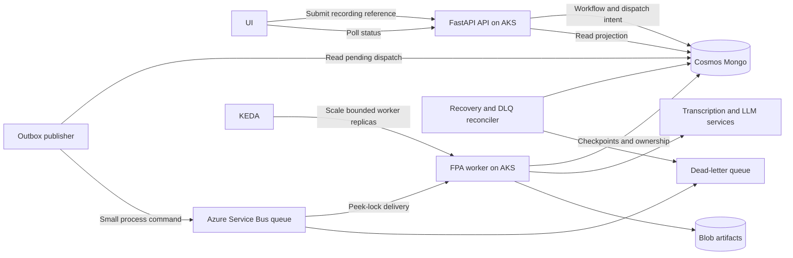
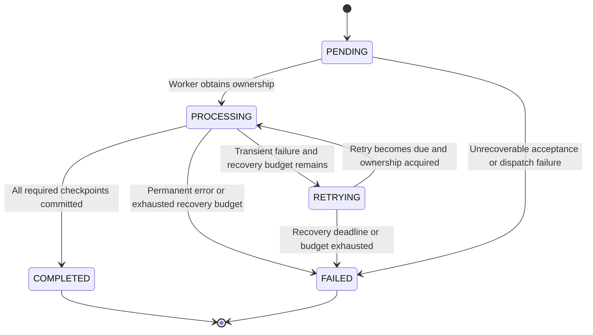

# FPA Insurance Recording and Analysis Pipeline

**Comprehensive implementation and operations guide**  
**Prepared:** 26 September 2026  
**Source:** [Learn Nonrelational Databases](chatgpt-conversation://6ab761bc-b5c8-83ee-b23d-a4657016e526)

## How to use this document

This document preserves the FPA implementation discussion and develops it into a concrete design for migration from FastAPI `BackgroundTasks` to Azure Service Bus and a separate AKS worker. It includes the existing behavior, the proposed architecture, state and message contracts, retry boundaries, failure recovery, operations, and phased implementation.

The main guide is a consolidated engineering specification. Appendix B preserves the retrieved conversation in chronological order, including its examples and earlier alternatives. Read the main guide when implementing: some early conversation examples used `FAILED` for an individual failed attempt, or implied that queue redelivery automatically provides delayed retry. The main guide resolves these ambiguities explicitly.

**Evidence boundary:** The existing behavior below is reported by the user in the conversation. No FPA repository, Azure account, live configuration, or deployment was inspected. Field names, APIs, configuration values, and code in this guide are proposed implementation contracts or illustrative examples, not a claim that they already exist. The source conversation did not specify what the acronym FPA expands to.

**Platform assumption:** The Cosmos guidance concerns **RU-based Azure Cosmos DB for MongoDB**. Verify the deployed Mongo API version and account capabilities before applying it. A vCore-based Mongo-compatible deployment has different operational characteristics. Numerical values are starting examples unless specifically identified as documented service behavior.

## Contents

1. [Business flow and confirmed current implementation](#1-business-flow-and-confirmed-current-implementation)
2. [Target architecture and component ownership](#2-target-architecture-and-component-ownership)
3. [Reliability invariants](#3-reliability-invariants)
4. [Stage sequencing and checkpoint/resume](#4-stage-sequencing-and-checkpointresume)
5. [Cosmos workflow schema](#5-cosmos-workflow-schema)
6. [State transitions and terminal outcomes](#6-state-transitions-and-terminal-outcomes)
7. [Submission API and durable acceptance](#7-submission-api-and-durable-acceptance)
8. [Queue contract and delivery semantics](#8-queue-contract-and-delivery-semantics)
9. [Worker execution and message settlement](#9-worker-execution-and-message-settlement)
10. [Ownership, leases, fencing, and safe updates](#10-ownership-leases-fencing-and-safe-updates)
11. [Idempotency and artifact persistence](#11-idempotency-and-artifact-persistence)
12. [Retry hierarchy and budgets](#12-retry-hierarchy-and-budgets)
13. [LLM and transcription retries](#13-llm-and-transcription-retries)
14. [Cosmos resilience and ambiguous writes](#14-cosmos-resilience-and-ambiguous-writes)
15. [Delayed retries, outage handling, and reconciliation](#15-delayed-retries-outage-handling-and-reconciliation)
16. [DLQ and operator recovery](#16-dlq-and-operator-recovery)
17. [Dual writes and the outbox](#17-dual-writes-and-the-outbox)
18. [Polling API and UI behavior](#18-polling-api-and-ui-behavior)
19. [Connections, pooling, timeouts, and repository design](#19-connections-pooling-timeouts-and-repository-design)
20. [Cosmos partitioning, indexing, and RU planning](#20-cosmos-partitioning-indexing-and-ru-planning)
21. [Concurrency, backpressure, AKS, and KEDA](#21-concurrency-backpressure-aks-and-keda)
22. [Caching](#22-caching)
23. [Monitoring and observability](#23-monitoring-and-observability)
24. [Failure scenarios and expected recovery](#24-failure-scenarios-and-expected-recovery)
25. [Implementation structure and pseudocode](#25-implementation-structure-and-pseudocode)
26. [Recommended implementation phases](#26-recommended-implementation-phases)
27. [Verification and acceptance criteria](#27-verification-and-acceptance-criteria)
28. [Configuration decisions still to confirm](#28-configuration-decisions-still-to-confirm)
29. [Appendix A: Official references and clarifications](#appendix-a-official-references-and-clarifications)
30. [Appendix B: Preserved source conversation](#appendix-b-preserved-source-conversation)

## 1. Business flow and confirmed current implementation

FPA records an interaction between an insurance agent and a potential customer. The recording is then processed through five stages:

```text
Customer and insurance agent interaction
    -> recording created / uploaded / registered
    -> transcription
    -> summarisation
    -> profiling
    -> compliance analysis
    -> behaviour modelling
    -> final processed interaction
```

The user confirmed these current properties:

- FastAPI receives the request and uses `BackgroundTasks` to run the pipeline.
- The stages run sequentially.
- Failure of a stage stops execution of subsequent stages.
- Each stage has an LLM call with a stated five-retry policy. The conversation does not establish whether the implementation means five total attempts or five retries after an initial call.
- There is no separate mechanism to restart the workflow after a stage exhausts its local retries.
- Cosmos Mongo stores stage statuses.
- A polling API reads Cosmos status; the UI polls that API until completion.
- The requested migration is publishing work to a queue and consuming it in a separate AKS worker service.

The source does not identify the transcription provider or prove that transcription itself is an LLM request. Treat its external service calls under the same resilience principles, with provider-specific classification.

### 1.1 Current request and execution path

```text
UI -> FastAPI POST
         |-> create/update Cosmos workflow document
         |-> background_tasks.add_task(run_pipeline, interaction_id)
         `-> return response

FastAPI process -> transcription -> summary -> profiling -> compliance -> behaviour
                         |             |          |            |             |
                         `-------------+----------+------------+-------------'
                                                   -> Cosmos checkpoints

UI -> polling API -> Cosmos status
```

`BackgroundTasks` runs work associated with the application process after responding. It does not supply a durable broker message or resurrect an interrupted Python task after a pod restart. FastAPI points to external worker systems for heavier work across processes or servers. [FastAPI background tasks](https://fastapi.tiangolo.com/tutorial/background-tasks/)

Consider a pod dying after transcription finishes but before its completion checkpoint is stored. Cosmos can still say `PROCESSING`, while the executor is gone. Even when transcription was checkpointed, nothing automatically starts summary after the process disappears. Persisted statuses are necessary, but they do not by themselves schedule recovery.

### 1.2 Local call resilience versus workflow resilience

Five attempts at one LLM call can absorb a short outage. They do not recover a pod crash, a queue-publish failure, or a Cosmos write whose outcome is unknown. The missing property is **restartability from durable checkpoints**, together with a durable mechanism that invokes that restart.

An intermediate improvement discussed was to keep BackgroundTasks while making the runner resumable, adding a manual retry endpoint and a recovery scanner. That remains a useful implementation stepping stone; the selected destination is Service Bus plus a separate worker.

## 2. Target architecture and component ownership



For an initial direct-publish implementation, the API publishes to Service Bus itself after writing Cosmos. The outbox publisher in this diagram is the durable solution to the gap between those two independent writes; section 17 explains both paths.

| Component | Responsibility | Durable ownership |
|---|---|---|
| UI | Submit requests, observe progress, show completion/failure/recovery | None of the execution state |
| FastAPI API | Validate, authenticate, accept work, expose status/results | Acceptance contract |
| Cosmos Mongo | Workflow state, checkpoints, ownership, retry decisions, output references | Authoritative workflow truth |
| Service Bus | Buffer and deliver commands, retain uncompleted work subject to configured policies | Delivery trigger |
| AKS worker | Execute the ordered stages and persist results | Disposable executor |
| Blob Storage | Audio, transcripts, large structured/model outputs | Durable artifacts |
| Outbox publisher | Convert persisted dispatch intent into broker messages | Recoverable dispatch |
| Recovery reconciler | Find stalled dispatch, expired ownership, due retries, DLQ status gaps | Eventual repair |
| Operations tooling | Inspect and deliberately replay failed jobs | Audited intervention |

The worker is a separate Kubernetes **Deployment**. It need not have a public HTTP endpoint or Kubernetes Service just to consume messages. The API and worker can share a code package while using different entry points, resource limits, replica counts, and deployment schedules.

Start with **one pipeline queue and one worker deployment**. One message asks the worker to run or resume the entire sequential pipeline. Queues between stages are a later option if independent scaling, resource requirements, or verified parallel dependencies justify the additional coordination.

## 3. Reliability invariants

These are proposed correctness requirements for FPA, derived from the failure cases in the conversation:

1. **Cosmos defines what has completed.** A message is a command, not a snapshot of authoritative workflow state.
2. **Persist durable results and final state before completing the message.** Acknowledging first can remove the last recovery trigger.
3. **Treat delivery as at least once.** A worker can finish and crash before the broker receives completion.
4. **Completed stages are skipped only when their versioned checkpoint is valid.** A status label alone is insufficient if the input, prompt, or rules changed.
5. **Only the current owner may commit a stage result.** Expired workers must not overwrite successors.
6. **Local retries are bounded by attempts and elapsed time.** Automatic recovery has a separate durable budget.
7. **Transient attempt failure is not terminal workflow failure.** The UI must not stop while recovery is still intended.
8. **A missing status update during a Cosmos outage cannot be magically persisted.** Delivery state and reconciliation must bridge that gap after recovery.
9. **Every accepted job needs a durable route to execution or a visible terminal outcome.** A `PENDING` document with no dispatch mechanism violates this requirement.
10. **Duplicate computation may occur; duplicate logical effects must be controlled.** LLM calls and their billing cannot generally be made exactly once by queue configuration.
11. **The queue is a buffer, not unlimited capacity.** Retention, TTL, quotas, max delivery count, and downstream capacity still apply.
12. **A worker can disappear at any instruction.** Recovery must not depend on its local memory or shutdown handler running.

## 4. Stage sequencing and checkpoint/resume

The migration preserves this order:

```python
STAGES = (
    "transcription",
    "summary",
    "profiling",
    "compliance",
    "behaviour",
)
```

For each stage, the runner loads authoritative state, checks prerequisites and versions, skips a valid completed checkpoint, claims unfinished work, executes it, persists its output, commits its completion, and then advances.

Example after a failure:

| Stage | Durable state | Next execution |
|---|---|---|
| Transcription | COMPLETED | Skip |
| Summary | COMPLETED | Skip |
| Profiling | COMPLETED | Skip |
| Compliance | RETRYING | Retry when eligible |
| Behaviour | PENDING | Run only after compliance completes |

Do not wrap an unconditional five-stage runner in a whole-pipeline retry decorator. Calling `run_pipeline(id)` again is safe only because the runner consults checkpoints before each stage.

### 4.1 What a complete checkpoint means

A completed stage has a durable output or verified output reference, the input identity/hash it processed, processor and prompt/rule versions where relevant, a completion timestamp, and the winning attempt identity. A stage should not become `COMPLETED` while its result exists only in worker memory.

An asynchronous transcription job may return an external operation ID long before its transcript is ready. Persist that ID. On resume, query that operation before submitting another paid transcription job.

### 4.2 Potential future parallelism

The earlier conversation considered summary, profiling, and compliance potentially running in parallel if all depend only on the transcript, followed by a join before behaviour modelling. This is an option, not a confirmed dependency graph. Preserve the sequential behavior until actual dependencies and validation requirements are established. Parallel execution would also change ownership, retry coordination, downstream quotas, and completion aggregation.

## 5. Cosmos workflow schema

The following is a proposed JSON representation. Store timestamps consistently as UTC BSON dates in Mongo, rather than mixing incomparable string/date types. Use the actual configured shard-key field; `tenantId` here is an example, not a selected production partitioning decision.

```json
{
  "_id": "INT-123",
  "tenantId": "TENANT-01",
  "agentId": "AG001",
  "customerId": "C001",
  "schemaVersion": 1,
  "pipelineVersion": "fpa-v1",
  "runGeneration": 1,
  "inputHash": "sha256:recording-content-hash",
  "requestIdempotencyKey": "client-operation-abc",
  "requestFingerprint": "sha256:canonical-request-hash",
  "correlationId": "corr-123",
  "workflowStatus": "PROCESSING",
  "currentStage": "compliance",
  "stateRevision": 12,
  "createdAt": "2026-09-26T06:00:00Z",
  "updatedAt": "2026-09-26T06:05:00Z",
  "completedAt": null,
  "failedAt": null,
  "recording": {
    "status": "READY",
    "blobReference": "recordings/INT-123/audio.wav"
  },
  "execution": {
    "workerId": "fpa-worker-pod-7",
    "claimToken": "claim-unique-for-this-acquisition",
    "leaseUntil": "2026-09-26T06:07:00Z",
    "heartbeatAt": "2026-09-26T06:05:00Z",
    "workflowAttempt": 2,
    "lastMessageId": "INT-123:g1:dispatch-1"
  },
  "retry": {
    "nextRetryAt": null,
    "recoveryCycle": 1,
    "maxRecoveryCycles": 5,
    "deadlineAt": "2026-09-27T06:00:00Z"
  },
  "dispatch": {
    "eventId": "INT-123:g1:dispatch-1",
    "eventType": "PROCESS_INTERACTION",
    "status": "PUBLISHED",
    "notBefore": "2026-09-26T06:00:00Z",
    "publishedAt": "2026-09-26T06:00:01Z",
    "publishAttempt": 1,
    "publisherClaimToken": null,
    "publisherLeaseUntil": null
  },
  "stages": {
    "transcription": {
      "status": "COMPLETED",
      "stageAttempt": 1,
      "processorVersion": "transcriber-v1",
      "outputReference": "artifacts/INT-123/g1/transcription/attempt-1.json"
    },
    "summary": {
      "status": "COMPLETED",
      "stageAttempt": 1,
      "processorVersion": "summary-v1",
      "outputReference": "artifacts/INT-123/g1/summary/attempt-1.json"
    },
    "profiling": {
      "status": "COMPLETED",
      "stageAttempt": 1,
      "processorVersion": "profile-v1",
      "outputReference": "artifacts/INT-123/g1/profiling/attempt-1.json"
    },
    "compliance": {
      "status": "PROCESSING",
      "stageAttempt": 2,
      "lastLLMAttempts": 1,
      "startedAt": "2026-09-26T06:05:00Z",
      "updatedAt": "2026-09-26T06:05:00Z",
      "completedAt": null,
      "processorVersion": "compliance-v3",
      "promptVersion": "compliance-prompt-v2",
      "rulesVersion": "rules-2026-09",
      "inputHash": "sha256:stage-input-hash",
      "logicalResultKey": "INT-123:g1:COMPLIANCE:v3",
      "attemptToken": "compliance-attempt-unique-2",
      "outputReference": null,
      "externalOperationId": null,
      "lastError": null
    },
    "behaviour": {
      "status": "PENDING",
      "stageAttempt": 0,
      "outputReference": null
    }
  },
  "lastError": null,
  "terminalDecision": null
}
```

For brevity inside this example, completed stages omit some fields shown in compliance. The implementation should define one consistent stage model with nullable fields, not five unrelated schemas. Keep attempt histories in bounded records or a separate audit collection rather than an indefinitely growing array in the workflow document.

An error record should identify the component, stable application error code, safe message, retryability, timestamp, stage attempt, and relevant provider code. Never store secrets or unredacted provider bodies in public status responses.

```json
{
  "component": "llm",
  "code": "LLM_RATE_LIMIT",
  "providerCode": "429",
  "message": "Analysis provider is temporarily rate limited",
  "retryable": true,
  "occurredAt": "2026-09-26T06:06:00Z",
  "stageAttempt": 2
}
```

Keep distinct meanings for `schemaVersion`, `pipelineVersion`, `processorVersion`, `promptVersion`, `rulesVersion`, `runGeneration`, and `stateRevision`. One generic `version` cannot safely represent all of them.

## 6. State transitions and terminal outcomes



Use `PENDING`, `PROCESSING`, `RETRYING`, `COMPLETED`, and `FAILED` for the baseline workflow and stage contracts. `FAILED` is terminal for the current run generation. If the UI needs fewer states, map `RETRYING` to a processing view while retaining the richer internal status.

The original discussion also used `RETRY`, `FAILED_RETRYABLE`, and `FAILED` with a `retryable` flag. These describe recovery-eligible attempts. Normalize them during implementation so that the UI never mistakes a local failure for an irrecoverable workflow outcome.

An operator retry after terminal failure is an explicit audited reopen or new run generation. It is not an ordinary automatic transition from terminal `FAILED`. Decide whether prior checkpoints remain valid and retain the previous failure record.

Workflow completion requires every required stage to be complete for the active generation. A worker exception alone does not justify terminal failure. A DLQ entry alone also does not prove the business workflow failed: it might be a duplicate whose original execution completed successfully.

## 7. Submission API and durable acceptance

### 7.1 Proposed request contract

```http
POST /api/fpa/interactions
Idempotency-Key: client-operation-abc
Content-Type: application/json

{
  "recordingReference": "recordings/upload-123/audio.wav",
  "agentId": "AG001",
  "customerId": "C001"
}
```

Derive tenant scope from authenticated context. Validate authorization, required metadata, recording existence/readiness, supported input, and allowable request size before accepting work. The upload protocol itself was not specified; the pipeline command should be created only when the recording is durably available.

For repeated submission, bind a tenant-scoped idempotency key to a canonical request fingerprint. The same key and same payload returns the existing interaction. The same key with a conflicting payload returns a conflict rather than silently changing an existing job. Enforce uniqueness using a design compatible with the deployed shard-key and index constraints.

### 7.2 Accepted response

```http
HTTP/1.1 202 Accepted
Location: /api/fpa/interactions/INT-123/status
Retry-After: 2
Cache-Control: no-store
Content-Type: application/json

{
  "interactionId": "INT-123",
  "status": "PENDING",
  "statusUrl": "/api/fpa/interactions/INT-123/status",
  "retryAfterSeconds": 2
}
```

`202` acknowledges durable acceptance, not completion. With an embedded outbox, acceptance means the workflow and dispatch intent were persisted in one document write. With direct publishing, the API must handle publication failure and ambiguity, and a scanner must repair stranded jobs. The caller may retry after a lost HTTP response; request idempotency prevents a second logical workflow.

The asynchronous request-reply pattern uses an acceptance response, a status location, and polling guidance. [Azure asynchronous request-reply](https://learn.microsoft.com/en-us/azure/architecture/patterns/asynchronous-request-reply)

If Cosmos cannot persist acceptance, do not report a new job as safely accepted. Return an appropriate retryable service error. If an acceptance write may have succeeded before a timeout, resolve by the stable request identity rather than creating a different ID on retry.

## 8. Queue contract and delivery semantics

### 8.1 Small command envelope

```json
{
  "schemaVersion": 1,
  "eventType": "PROCESS_INTERACTION",
  "interactionId": "INT-123",
  "tenantId": "TENANT-01",
  "runGeneration": 1,
  "dispatchEventId": "INT-123:g1:dispatch-1",
  "correlationId": "corr-123"
}
```

Use `dispatchEventId` as the broker message ID for repeated sends of the same dispatch intent. Use a new event ID for a deliberately new retry dispatch or operator replay. Keep the interaction and generation stable as appropriate. Do not put recordings, full transcripts, credentials, long-lived access tokens, or a copy of all workflow state in the message.

The worker validates schema, event type, identity, and generation before processing. If the envelope is malformed and cannot identify a workflow, dead-letter it with a safe reason; do not invent a Cosmos ID to mark failed.

### 8.2 Peek-lock and competing consumers

Use Peek-Lock. A receiver holds a temporary exclusive broker lock on one message. Successful completion removes it; abandon releases it for redelivery; lock expiry allows another receiver to obtain it; explicit dead-lettering moves it to the dead-letter subqueue. Receive-and-delete removes this recovery opportunity. Settlement can itself fail. [Service Bus settlement semantics](https://learn.microsoft.com/en-us/azure/service-bus-messaging/message-transfers-locks-settlement)

Multiple worker replicas are competing consumers of one queue, not a broadcast fan-out. The broker lock protects a particular message, not every message referring to the same interaction. Duplicate command envelopes can still overlap, so Cosmos ownership remains necessary.

Do not depend on global FIFO ordering or completion order across competing consumers. The worker enforces stage ordering. Sessions are a possible future mechanism for ordered related commands, but they are not required merely to execute a single sequential pipeline command.

### 8.3 At-least-once and duplicate detection

The key failure window is: Cosmos completion succeeds, then the worker crashes before broker completion. Redelivery must observe the committed workflow and perform no duplicate analysis.

Service Bus duplicate detection, when configured on a supporting tier, uses message identity within its configured history window. It can reduce duplicate sends; it does not remove the need for consumer idempotency or prevent redelivery of an uncompleted message. [Duplicate detection](https://learn.microsoft.com/en-us/azure/service-bus-messaging/duplicate-detection)

Configure queue TTL, capacity, delivery limits, dead-letter behavior, and retention expectations explicitly. An outage must not silently age accepted work out of the system.

## 9. Worker execution and message settlement

### 9.1 Successful execution

```text
Receive message under Peek-Lock
    -> start bounded lock renewal
    -> validate envelope
    -> read Cosmos with ID and shard key
    -> verify run generation and dispatch eligibility
    -> acquire workflow lease atomically
    -> run/resume stages in order
    -> persist each result and stage checkpoint
    -> atomically mark workflow COMPLETED
    -> complete Service Bus message
    -> release local execution capacity
```

If the workflow is already completed for the same run, complete the duplicate command without rerunning stages. If a message is stale for an older generation, dispose of it under the stale-command policy without modifying the newer run.

### 9.2 Settlement decision table

| Observed outcome | Cosmos action | Broker action |
|---|---|---|
| Workflow succeeds | Commit final COMPLETED | Complete |
| Valid duplicate for already completed run | No business change | Complete |
| Short transient failure, redelivery policy selected | Record RETRYING if possible | Abandon, or let lock expire on crash |
| Durable delayed retry intent committed | Record RETRYING, due time, new dispatch intent | Complete old command after durable handoff |
| Permanent input/business error | Persist FAILED with reason | Dead-letter |
| Cosmos unavailable, outcome unknown | Do not assume a write failed or claim success | Do not complete without durable recovery evidence |
| Message lock lost | Stop advancing work; preserve fenced checkpoints | Do not settle using the lost lock |
| Another workflow owner is active | Do not execute concurrently | Use bounded wait or durable retry handoff; avoid rapid abandon loops |
| Invalid envelope without usable identity | No arbitrary workflow mutation | Dead-letter with safe validation reason |

The delayed-retry row is an intentional extension of “state before ACK”: the old command may be completed before the whole workflow finishes **only after another durable execution intent has been committed**. Without that handoff, early completion is unsafe.

### 9.3 Long execution and lock renewal

A recording workflow may outlast one broker lock. Configure automatic renewal or explicit renewal for a bounded duration that covers expected execution plus settlement margin. Monitor renewal failures and avoid receiving far more work than available execution slots can start promptly.

The broker lock and Cosmos lease are distinct. Renew both while healthy. Loss of broker ownership does not undo an external LLM call already in flight; fence its result commit. If renewal or heartbeat fails, stop starting new stages and relinquish or allow ownership to expire safely.

Do not block the event loop with synchronous database calls or CPU-heavy audio processing, because that can starve renewals. Graceful pod shutdown should stop receiving new messages, drain within the termination budget, and leave unfinished work recoverable if draining cannot finish.

## 10. Ownership, leases, fencing, and safe updates

For the initial single sequential runner, prefer one workflow lease plus per-stage attempt tokens. This is simpler than five independent concurrent owners. A later parallel graph may need stage-specific leases.

### 10.1 Atomic claim

Generate a unique `claimToken` once per acquisition attempt. Use one conditional update that includes the interaction ID, actual shard key, active run generation, eligible state, and absent/expired ownership. Set the owner, lease expiry, heartbeat, and processing state together.

```python
# Illustrative synchronous PyMongo operation. Eligibility must also check
# retry due time and dispatch/generation policy in the real repository.
claim_filter = {
    "_id": interaction_id,
    "tenantId": tenant_id,
    "runGeneration": generation,
    "workflowStatus": {"$in": ["PENDING", "RETRYING", "PROCESSING"]},
    "$or": [
        {"execution.leaseUntil": {"$lte": now}},
        {"execution.leaseUntil": None},
    ],
}
claim_update = {
    "$set": {
        "execution.workerId": worker_id,
        "execution.claimToken": claim_token,
        "execution.leaseUntil": lease_until,
        "execution.heartbeatAt": now,
        "workflowStatus": "PROCESSING",
        "updatedAt": now,
    },
    "$inc": {"execution.workflowAttempt": 1, "stateRevision": 1},
}
result = collection.update_one(claim_filter, claim_update)
```

This illustrates compare-and-set; it is not a complete lease implementation. Use a consistent clock policy and margin for skew. An expired lease makes work eligible for recovery; it does not prove the former worker stopped. That is why subsequent writes need fencing.

If claim response is lost, read back and compare the exact token. Do not generate a new token and blindly increment attempt counters. If the token is yours and the lease remains valid, the acquisition succeeded. If another token owns it, you must not proceed. Zero modified rows is not enough to distinguish a completed workflow, an active owner, or a lost-response retry.

### 10.2 Fenced checkpoint

```python
completion_filter = {
    "_id": interaction_id,
    "tenantId": tenant_id,
    "runGeneration": generation,
    "execution.claimToken": claim_token,
    "execution.leaseUntil": {"$gt": now},
    "stages.compliance.status": "PROCESSING",
    "stages.compliance.attemptToken": attempt_token,
}
completion_update = {
    "$set": {
        "stages.compliance.status": "COMPLETED",
        "stages.compliance.outputReference": output_reference,
        "stages.compliance.completedAt": now,
        "stages.compliance.updatedAt": now,
        "updatedAt": now,
    },
    "$inc": {"stateRevision": 1},
}
```

A successful matched update commits the selected output. If the response is ambiguous, read back the stage's attempt token, generation, status, and output reference. If it already matches the intended completion, treat that as success. If ownership changed, do not overwrite the winner.

Checking only `workerId` is weaker: a process identity may be reused across attempts. Use a unique claim/acquisition token, and use an attempt token where a workflow lease can span multiple attempts. Heartbeats must also be conditional so an expired worker cannot revive its old lease after a successor acquires it.

## 11. Idempotency and artifact persistence

Idempotency means repeated execution has one intended logical effect. It does not mean two LLM invocations necessarily return identical text or incur only one charge.

Use stable logical identities such as:

```text
interaction + run generation + stage + processor/prompt/input version
INT-123:g1:COMPLIANCE:v3
```

The source proposed replacing/upserting the same logical result rather than appending another result on every retry. For distributed workers, strengthen that design:

1. Write each attempt's artifact to an immutable attempt-specific location, or use a storage conditional-write mechanism.
2. Commit the authoritative output reference in Cosmos using the current claim and attempt token.
3. Readers follow only the committed reference.
4. A losing or crashed attempt may leave an unreferenced artifact; clean it up later under a retention policy.

This prevents a stale worker overwriting a blob path after a newer worker's Cosmos checkpoint won. A deterministic file name alone is not a concurrency guarantee.

If artifact upload succeeded but checkpoint failed, resolve whether the same candidate output can be reused before paying for another LLM call. Persist enough identity to match artifacts to the intended inputs and versions. Do not reuse an output from a different generation or invalidated upstream stage.

For side effects such as notifications or external business updates, use a separate stable operation ID and durable outbox/idempotency record. Skipping a completed analysis stage does not automatically deduplicate a separately emitted email or downstream API call.

For counter updates and append operations, distinguish application retries from a driver's supported retryable-write protocol. Blindly repeating `$inc` or `$push` after a network timeout can duplicate effects. Conditional tokens and read-back verification are required.

## 12. Retry hierarchy and budgets

```text
Workflow execution
  |
  +-- LLM / transcription operation
  |      -> bounded transient retry with backoff and jitter
  |
  +-- Cosmos repository operation
  |      -> bounded application policy
  |          -> eligible driver retries, if supported/configured
  |              -> Cosmos SSR for throttling, if enabled
  |
  `-- unrecovered transient failure
         -> persist retry decision when possible
         -> redelivery or durable delayed dispatch
         -> resume from Cosmos checkpoints
         -> terminal failure / DLQ when policy is exhausted
```

These layers are not all a linear retry chain. LLM calls and Cosmos calls are separate branches within a stage. Driver and SSR work may be nested inside a single Cosmos attempt. Measure each layer separately.

| Layer | Purpose | Proposed control |
|---|---|---|
| LLM local retry | Brief 429/timeout/temporary provider failure | Explicit max attempts, per-call timeout, elapsed budget |
| Cosmos application retry | Brief connection/throttling failure | Often 2–3 total attempts, safe operations only, one deadline |
| Driver retry | Eligible protocol-level failures | Configure against deployed Mongo capability |
| Cosmos SSR | Rate-limited database requests | Account setting; include its latency in budget |
| Workflow/stage recovery | Resume a failed execution | Persist stage attempts, recovery cycles, due time, deadline |
| Broker delivery count | Stop repeated unsuccessful message delivery | Configure and observe, but do not use as sole business budget |
| Operator replay | Recover after repair | Authorized, audited new dispatch/generation policy |

If a stage uses five total local LLM attempts on each of ten delivered executions, that stage can make roughly fifty provider calls before other constraints intervene. It is not five calls for the whole workflow. Driver-internal retry, new retry messages, and manual replay can change the actual number. Track total cost/attempt/time bounds in Cosmos if they matter to business policy.

Exponential backoff with full jitter can use `random(0, min(cap, base * 2**attempt_index))`. Honor a provider's valid retry delay where available. Refuse a sleep or next attempt that exceeds the remaining deadline. A retry budget includes waits, network operations, internal driver retries, and time needed to persist state safely.

Use explicit names such as `MAX_LLM_ATTEMPTS=5`, meaning five total calls, rather than ambiguous `retries=5`.

## 13. LLM and transcription retries

| Failure | Classification | Response |
|---|---|---|
| Temporary rate limit / 429 | Usually transient | Honor delay, back off, limit concurrency |
| Temporary 5xx or connection reset | Usually transient | Bounded retry |
| Request timeout | Potentially transient, outcome may be unknown | Retry with operation identity if provider supports it |
| Invalid request or unsupported model parameters | Permanent until changed | Stop repeating identical request |
| Authentication or authorization failure | Configuration incident | Alert, pause affected consumption; no tight retry loop |
| Missing transcript | Dependency/state issue | Verify upstream checkpoint and artifact; do not blindly invoke downstream |
| Invalid audio or unrecoverable input | Permanent input issue | Terminal outcome with clear reason |
| Structured output validation failure | Provider/application boundary | Explicit bounded repair policy, then escalate |
| Content-policy rejection | Explicit business handling needed | Do not repeatedly submit identical content to bypass rejection |
| Programming exception | Usually code defect | Capture diagnostic context and bound redelivery |

A stage attempt is not an LLM attempt. `stageAttempt=2` may contain `lastLLMAttempts=5`. Preserve that distinction in telemetry and durable state. If the provider SDK also retries automatically, account for or disable overlapping retries as supported by that SDK.

Pin the prompt, processor, model configuration, and compliance-rule version for a run so retries do not silently analyze the same recording under different rules. If a configuration change requires reanalysis, create an explicit new run/version and determine which downstream checkpoints must be invalidated.

After local retries exhaust, persist `RETRYING` if recovery remains possible, then return control to the workflow recovery policy. Do not continue to behaviour when required compliance analysis failed.

## 14. Cosmos resilience and ambiguous writes

Centralize database resilience in the repository/infrastructure boundary instead of sprinkling retry decorators across all business functions.

### 14.1 Error classification

| Signal | Interpretation | FPA policy |
|---|---|---|
| AutoReconnect, ConnectionFailure, network interruption | Potentially temporary connectivity/failover | Bounded retry; resolve write outcome |
| Server-selection timeout | No suitable server in budget; may also indicate persistent configuration issue | Short retry, then diagnose/back off |
| Mongo code 16500 | RU throttling | Backoff/SSR policy plus capacity control |
| Mongo code 50 | Time limit exceeded; not always the same root cause | Inspect context; resolve writes before replay |
| Duplicate key 11000 | Existing identity or genuine conflict | Read existing record and compare; not blind transient retry |
| Unauthorized/authentication failure | Permission/credential problem | Alert and repair configuration |
| Invalid query, unsupported operation, index issue | Design or code problem | Fail predictably; avoid repeat storm |

Microsoft identifies 16500 as rate limiting and cautions that timed-out writes can need careful handling to avoid duplicate effects. [Cosmos Mongo error guidance](https://learn.microsoft.com/en-us/azure/cosmos-db/mongodb/error-codes-solutions)

### 14.2 SSR and driver capabilities

Cosmos Server Side Retry retries rate-limited operations internally. Microsoft documents a 60-second server-side timeout after which code 50 can be returned. This is not permission for the application to allow every call to block for a minute or to wrap three such calls in another long loop. [SSR behavior](https://learn.microsoft.com/en-us/azure/cosmos-db/mongodb/prevent-rate-limiting-errors)

Verify API version, PyMongo version, connection-string flags, `EnableMongoRetryableWrites`, and SSR before changing retry settings. The Mongo 5.0 compatibility documentation requires shard-key information for affected sharded writes and documents restrictions including unordered bulk writes under retryable writes. [Mongo 5.0 supported features](https://learn.microsoft.com/en-us/azure/cosmos-db/mongodb/feature-support-50)

An outer timeout does not prove the server did not apply a write. The operation may have succeeded while the response was lost. For claims, completions, inserts, and dispatch changes, use stable identities and read-back reconciliation. A timeout wrapper around non-idempotent business effects is insufficient.

### 14.3 Critical failure: output succeeded, Cosmos failed

```text
Compliance LLM succeeds
    -> artifact persisted
    -> Cosmos completion write times out
    -> worker cannot know whether checkpoint committed
    -> do not complete message as if whole workflow succeeded
    -> read back matching stage token when possible
    -> otherwise redelivery resumes after Cosmos recovers
```

Recovery first checks whether the stage is already committed, then whether the exact durable candidate result can safely be adopted, and finally whether re-execution is necessary. Re-execution may incur an additional LLM charge; the committed workflow still selects only one result.

### 14.4 Persistent throttling and outage

If required throughput is 8,000 RU/s and available throughput is 4,000 RU/s, extra retries do not create capacity. Reduce concurrency, address hot keys, optimize query/index/document cost, or provision suitable throughput. Leave excess work in the queue instead of acquiring it repeatedly and burning delivery counts.

When Cosmos is unavailable, workers cannot reliably claim work or checkpoint it. Pause/back off receives, keep new work buffered where possible, and use health probes/circuit breaking with a controlled recovery ramp. A worker also may be unable to write `RETRYING`; the last visible status can remain `PROCESSING` until reconciliation.

## 15. Delayed retries, outage handling, and reconciliation

### 15.1 Redelivery is not a retry schedule

The conversation described fast local retries and slower queue recovery. Preserve that separation, but implement the time dimension explicitly. Abandon releases a message promptly; it does not implement exponential backoff. Lock expiry is a recovery mechanism for lost consumers, not a precise retry scheduler.

There are two practical operating modes:

| Mode | Mechanism | Appropriate use |
|---|---|---|
| Simple broker redelivery | Abandon after bounded local attempts, with fleet-level receive throttling/circuit breaking | Initial controlled implementation, short failures |
| Durable scheduled recovery | Commit retry due time plus new dispatch intent, then have publisher dispatch when due | Longer outages, explicit delays, auditable workflow budgets |

For durable delayed retry, atomically set the workflow to `RETRYING`, record `nextRetryAt`, increment a guarded recovery-cycle counter, and create a new embedded dispatch event with `notBefore`. Only then complete the old message. A publisher can send when due, or schedule a broker message using a supported scheduling operation. If the publisher is down, the intent remains discoverable in Cosmos.

The new message gets a new event ID so intentional retry is not suppressed by duplicate detection. Retries of *sending that same new event* reuse its event ID. Because a fresh message has its own broker delivery history, durable stage/workflow budgets must survive across messages.

Merely writing `nextRetryAt` does not wake a worker. A running scheduler/publisher or a broker-scheduled message must implement that wake-up. Likewise, merely deferring a Service Bus message does not make it reappear at a chosen time: deferral requires retrieval by sequence number and a durable wake-up design. [Service Bus deferral](https://learn.microsoft.com/en-us/azure/service-bus-messaging/message-deferral)

### 15.2 Reconciliation responsibilities

Run a bounded, observable recovery process with indexed/paged queries. Its responsibilities are:

1. Discover unpublished dispatch intents whose publisher lease expired.
2. Find due retries and ensure their dispatch intent is published.
3. Detect stale `PROCESSING` workflows using heartbeat and lease expiry.
4. Recover workflows left `PENDING` without a valid delivery intent in an intermediate direct-publish design.
5. Reconcile broker dead-letter outcomes into Cosmos.
6. Detect deadlines exceeded even when no worker is currently running.
7. Report inconsistent checkpoints, missing artifacts, or stuck terminal transitions for investigation.

Repair through conditional state transitions. Do not blindly reset every old `PROCESSING` document to `PENDING`: a slow healthy worker may still own it, or an older message may concern a previous run generation. Use bounded batches and rate limits so recovery scans do not compete destructively with normal processing and UI polling.

### 15.3 Broad outages

If all workers encounter invalid credentials or a sustained Cosmos outage, repeatedly receiving and abandoning every message can fill the DLQ quickly. Treat a fleet-wide configuration/dependency problem differently from one invalid recording: alert, pause or severely limit receive traffic, preserve backlog, and resume gradually after repair. A timeout alone does not establish which case applies.

## 16. DLQ and operator recovery

Service Bus can dead-letter explicitly rejected messages or messages that exceed its delivery limit. Microsoft documents a default maximum delivery count of 10; configure the actual queue deliberately. The DLQ does not automatically retry or repair a workflow, and expiry/dead-letter policies need deliberate configuration. [Service Bus dead-letter queues](https://learn.microsoft.com/en-us/azure/service-bus-messaging/service-bus-dead-letter-queues)

### 16.1 What goes into failure evidence

Retain interaction ID, tenant/routing identity, generation, dispatch event ID, correlation ID, failed stage, application error code, safe reason, stage and workflow attempt counts, message delivery count, timestamps, and processor/configuration versions. Keep sensitive recordings, transcript content, credentials, and large exception dumps out of broker properties.

### 16.2 Making DLQ visible to the UI

The broker does not update Cosmos when it dead-letters a message. This is a specific gap that must be implemented, or the UI may poll a permanently stale `PROCESSING` status.

An idempotent DLQ reconciliation flow should:

```text
Observe/receive dead-lettered message
    -> validate identity and generation
    -> read workflow
    -> check whether the workflow already completed or has newer valid work
    -> determine whether automatic recovery is exhausted for this run
    -> persist terminal failure or delivery incident as appropriate
    -> preserve operator evidence
    -> settle DLQ message only under the chosen archival policy
```

Never overwrite a valid `COMPLETED` workflow with `FAILED` just because a duplicate message reached the DLQ. Never let a stale old-generation message fail the current run. A message can also be dead-lettered for transport/schema reasons unrelated to a stage outcome.

If Cosmos is still unavailable, leave the DLQ message unsettled or retain a durable independent reconciliation record. Retry reconciliation later. Logging the error alone does not update the UI's source of truth. If the process completes DLQ messages after reconciliation, first archive sufficient durable evidence for operators; otherwise completing them removes their broker record.

### 16.3 Manual replay runbook

1. Locate the interaction and correlate workflow state, artifacts, logs, and DLQ evidence.
2. Identify whether the cause is input, configuration, code, provider availability, throttling, or an already-completed duplicate.
3. Repair the actual cause before replaying.
4. Decide whether the same run can resume or changed input/rules require a new generation.
5. Preserve prior error and attempt history.
6. Atomically create an authorized replay intent with a new dispatch event ID.
7. Publish through the same outbox path.
8. Remove/archive the original DLQ entry only after durable replay intent exists.
9. Verify the resumed stages, final state, and user-visible result.

An illustrative `POST /api/fpa/interactions/{id}/retry` endpoint must check authorization and eligibility, deduplicate repeated operator requests, and prevent collision with a healthy owner. In the temporary BackgroundTasks design it could enqueue the resumable runner locally; in the target design it writes a durable retry intent.

## 17. Dual writes and the outbox

### 17.1 Why direct writes leave a gap

```text
Write Cosmos PENDING succeeds
    -> publish Service Bus command fails
    -> workflow exists but no executor is scheduled
```

Reversing the order creates a different gap:

```text
Publish command succeeds
    -> Cosmos insert fails
    -> worker receives an interaction that cannot be loaded
```

There is no shared transaction across the Cosmos workflow write and Service Bus publication in this proposed design. Broker transactions do not automatically include Cosmos. An HTTP exception cannot undo a message already accepted by the broker.

### 17.2 Embedded outbox

Create the workflow and its first pending dispatch intent in **one document write**. This avoids depending on multi-document transaction support. Cosmos Mongo capabilities differ from native MongoDB and Cosmos NoSQL transactional batches; do not assume those APIs or transaction scopes apply.

```json
{
  "_id": "INT-123",
  "tenantId": "TENANT-01",
  "workflowStatus": "PENDING",
  "runGeneration": 1,
  "dispatch": {
    "eventId": "INT-123:g1:dispatch-1",
    "eventType": "PROCESS_INTERACTION",
    "status": "PENDING",
    "notBefore": "2026-09-26T06:00:00Z",
    "publisherClaimToken": null,
    "publisherLeaseUntil": null
  }
}
```

Publisher behavior:

1. Scan eligible pending/due intents with bounded, indexed queries.
2. Atomically acquire a publisher lease for the exact event ID.
3. Send the small command and await broker acceptance.
4. Mark that exact event `PUBLISHED` conditionally on its event ID and publisher token.
5. Retry failed or ambiguous sends using the same event ID.
6. Let expired publisher leases be recovered after a crash.

The publisher must not mark a *newer* retry intent published after sending an older event. Filtering by `dispatch.eventId` prevents that race. A single embedded current-intent slot is reasonable for one sequential active run; more complex fan-out requires a design that preserves all outstanding events without unbounded document growth.

### 17.3 Send succeeded, mark-published failed

The publisher may resend the same event. Duplicate detection can reduce repeated enqueueing, but worker idempotency remains necessary. The outbox provides recoverable **at-least-once publication**, not exactly-once execution.

Likewise, a worker may consume an event before the publisher records `PUBLISHED`. Consumer eligibility should validate the matching event identity and run, not require the publisher's bookkeeping update to have won the race first.

### 17.4 Intermediate implementation

A direct-publish API can be an implementation phase if it persists a dispatch marker, handles publish ambiguity, and has a scanner that recovers stranded pending jobs. Do not claim reliable acceptance merely because the happy-path API performs two consecutive writes. For production reliability, the embedded-outbox design closes the handoff gap more clearly.

## 18. Polling API and UI behavior

The UI can keep its existing polling architecture after execution moves to AKS workers. Cosmos serves both as the worker's durable state and the status API's read source. The public response should be a stable projection, not the entire internal workflow document.

### 18.1 Processing response

```http
HTTP/1.1 200 OK
Cache-Control: no-store
Retry-After: 2
Content-Type: application/json

{
  "interactionId": "INT-123",
  "status": "PROCESSING",
  "terminal": false,
  "currentStage": "COMPLIANCE",
  "progress": {"completed": 3, "total": 5},
  "stages": {
    "transcription": "COMPLETED",
    "summary": "COMPLETED",
    "profiling": "COMPLETED",
    "compliance": "PROCESSING",
    "behaviour": "PENDING"
  },
  "stateRevision": 12,
  "updatedAt": "2026-09-26T06:05:00Z",
  "retryAfterSeconds": 2
}
```

This guide chooses `200` for a successfully retrieved status resource, regardless of whether the job is finished; initial submission uses `202`. A different consistent documented status contract is possible. HTTP transport success and workflow success are separate concepts.

### 18.2 Retrying and terminal responses

```json
{
  "interactionId": "INT-123",
  "status": "RETRYING",
  "terminal": false,
  "currentStage": "COMPLIANCE",
  "message": "Analysis is temporarily delayed and will retry automatically.",
  "nextRetryAt": "2026-09-26T06:10:00Z",
  "retryAfterSeconds": 5
}
```

```json
{
  "interactionId": "INT-123",
  "status": "COMPLETED",
  "terminal": true,
  "progress": {"completed": 5, "total": 5},
  "resultUrl": "/api/fpa/interactions/INT-123/results"
}
```

```json
{
  "interactionId": "INT-123",
  "status": "FAILED",
  "terminal": true,
  "failedStage": "COMPLIANCE",
  "error": {
    "code": "RECOVERY_EXHAUSTED",
    "message": "Analysis could not be completed. Support can review this interaction."
  },
  "canRequestRetry": true
}
```

`canRequestRetry` is an authorization/policy result, not a guarantee that replay is safe without checking the cause. Do not expose worker identities, lease tokens, private blob paths, internal stack traces, or connection details to the UI.

### 18.3 Polling rules

- Start around 1–2 seconds for short early waits, then increase toward 2–5 seconds or an appropriate longer interval for delayed recovery.
- Use `Retry-After` or `retryAfterSeconds`, with jitter across clients.
- Do not start overlapping requests from the same screen.
- Stop on terminal success or terminal failure; do not poll only for `COMPLETED` forever.
- Treat status API timeout/503 as “status temporarily unavailable,” not evidence that the job failed.
- Retain the last known status and show its timestamp during a polling outage.
- On page reload, resume polling by interaction ID; do not resubmit the recording automatically.
- A browser waiting deadline may end active polling and show “check back later.” It must not mutate a still-running workflow to `FAILED`.
- Reject stale out-of-order responses using `stateRevision` within the same run generation, or avoid concurrent polls altogether.

At 100 ms intervals, one user generates 10 reads/second; 100 active users generate 1,000 status reads/second. At two-second intervals, 100 users generate about 50 reads/second. The latter is still a real capacity load and should be measured.

Progress `3/5` counts stages, not elapsed time. If transcription takes most of the runtime, 20% completed stages does not mean 20% of waiting time has elapsed. Avoid a misleading precise time estimate until measured stage durations support it.

### 18.4 Reads, consistency, and outages

Read with ID plus the actual shard key and request only fields needed for the public projection. Smaller responses reduce payload and coupling; do not assume projection reduces RU proportionally to bytes removed. Measure it.

```python
collection.find_one(
    {"_id": interaction_id, "tenantId": authenticated_tenant_id},
    {
        "workflowStatus": 1,
        "currentStage": 1,
        "stateRevision": 1,
        "runGeneration": 1,
        "updatedAt": 1,
        "stages": 1,
        "retry.nextRetryAt": 1,
    },
)
```

The API must still explicitly map stage fields into a sanitized DTO. A raw projection containing `stages` may include internal fields and is not itself a safe public response.

Worker writes and API reads may use separate clients and regions. Do not assume session consistency gives every independent API process immediate read-your-writes visibility for worker updates. Verify account consistency and routing behavior, tolerate temporary stale reads in the UI, and test completion visibility. The worker must use atomic write predicates, not trust a stale cached/read-only snapshot for ownership.

For a Cosmos outage, the status endpoint should return an appropriate service-unavailable response and retry guidance. It cannot honestly manufacture a new terminal workflow state while its authoritative store is inaccessible.

## 19. Connections, pooling, timeouts, and repository design

### 19.1 Client lifecycle

Create and reuse one Mongo client per process, after process creation. Initialize it during FastAPI/worker startup and close it on shutdown. Do not construct a new client for every status poll or stage update. Reuse supported Service Bus and external HTTP clients with clear lifecycle ownership too.

PyMongo manages connection pools; those pools reuse connections, not query results. Pool controls include maximum/minimum size, idle timeout, connection creation limits, and wait-queue timeout. [PyMongo connection pools](https://www.mongodb.com/docs/languages/python/pymongo-driver/current/connect/connection-options/connection-pools/)

Illustrative values from the conversation were `maxPoolSize=50`, `minPoolSize=5`, `maxIdleTimeMS=120000`, and `waitQueueTimeoutMS=5000`. They are tuning inputs, not validated FPA defaults. Evaluate idle connection behavior against the actual Azure network path and driver guidance; the conversation's 2–3 minute recommendation is not a universal invariant.

An approximate pool-capacity calculation is:

```text
10 pods × 4 processes/pod × 100 pooled connections/server
    = 4,000 potential pooled connections for one server endpoint
```

Actual totals can include topology/monitoring connections and multiple server pools. Raising pool sizes does not raise Cosmos RU capacity. Start from measured concurrency and operation duration, then measure pool wait and connection churn.

### 19.2 Async compatibility

If using synchronous `MongoClient`, calling it directly from an `async def` blocks that event loop. Use a bounded thread/executor integration, or a supported async PyMongo API validated against the installed version and Cosmos account. Keep the entire repository interface consistent. Do not assume that an `await` on a wrapper makes a synchronous network operation nonblocking.

### 19.3 Timeout budgets

Distinguish server selection, pool wait, connection establishment, socket wait, server execution, and overall operation deadlines. PyMongo supports client-side timeout budgeting through `timeoutMS` and timeout contexts in supported versions. [PyMongo timeouts](https://www.mongodb.com/docs/languages/python/pymongo-driver/current/connect/connection-options/csot/)

| Budget | Purpose |
|---|---|
| Submission request deadline | Bound how long a user waits for acceptance |
| Status API deadline | Keep polling responsive during database problems |
| Cosmos operation deadline | Cover the operation and its permitted internal work |
| LLM/transcription call deadline | Bound one external request |
| Stage local-retry budget | Include multiple calls and backoff |
| Workflow execution slice | Bound how much one delivery performs |
| Workflow recovery deadline | Bound total automatic recovery across deliveries |
| Broker renewal window | Maintain message ownership during a healthy execution |
| Cosmos lease/heartbeat interval | Detect lost workflow ownership |
| Pod termination grace period | Allow bounded draining without assuming it always succeeds |

The conversation used a five-second HTTP SLA and a two-to-three-second database budget as an example. Choose production values from requirements and measured latency. Reserve time for recording the outcome and settling the broker message; an execution that consumes its entire lock/deadline on the LLM call has no safe completion margin.

### 19.4 Repository boundary

```text
API / pipeline / recovery process
    -> workflow and artifact repositories
        -> shared resilience and telemetry policy
            -> PyMongo / Blob / Service Bus clients
```

Business code decides eligibility, dependencies, stage transitions, and terminal outcomes. Infrastructure code owns client lifecycle, deadline enforcement, retry classification, safe-write reconciliation helpers, backoff, and telemetry. Do not hide a failed checkpoint by catching the exception and returning a success-shaped value.

For bulk maintenance/backfills, use bounded batches, understand ordered versus unordered partial success, and reconcile only failed operations. Do not retry an entire partially successful batch without stable identities. Verify retryable-write restrictions for the selected Cosmos API/capability.

## 20. Cosmos partitioning, indexing, and RU planning

The earlier conversation explored Cosmos fundamentals because they directly affect FPA polling and workflow updates. These are design considerations to validate against the deployed account, not a claim about its existing shard key.

### 20.1 Choose the shard key from access patterns

Important FPA access patterns include reading one interaction for status, atomically claiming/updating it, listing a tenant's recent interactions, finding unpublished dispatch events, finding due retries, and finding expired leases.

A candidate key should be stable, distribute both data and traffic, and be available for frequent routed queries. `status`, `isActive`, or another low-cardinality mutable field is a poor candidate. `tenantId`, `agencyCode`, or interaction-derived routing may be candidates, but a large tenant or agency can still be a hot key. Evaluate actual distribution before choosing.

The message and authenticated API context must supply or safely derive the actual routing key. Adding a field literally named `partitionKey` to a query does not help unless it is the configured shard key.

### 20.2 Keep documents bounded

Store workflow metadata, state, and references in Cosmos. Store audio, large transcripts, detailed compliance/model outputs, and other large artifacts in Blob Storage. Avoid unbounded attempt/result arrays and large whole-document replacements.

Use targeted `$set`/conditional updates so independent metadata is not lost through stale document replacement. One interaction can still become a write hotspot if too many concurrent processes update it, even if the wider collection is distributed well.

### 20.3 Index concrete queries

Verify the indexes actually deployed; do not assume Cosmos Mongo automatically indexes every property because Cosmos NoSQL can behave differently. Candidate access patterns may require indexes on dispatch status/due time, workflow status/lease expiry, tenant plus creation time, or stage state plus retry timestamp. Match index definitions to real query filters and sort behavior and to the account's Mongo API support.

Recovery scans may legitimately span partitions, but make their cost explicit: page results, bound batches, avoid polling the entire collection at high frequency, and measure RU. The normal worker should consume queue commands; it should not repeatedly scan Cosmos looking for all pending work.

### 20.4 Capacity arithmetic

```text
Approximate RU/s requirement = sum(operation rate × measured RU/operation)

Include:
  API acceptance writes
  UI polling reads
  worker state reads and checkpoints
  lease heartbeats
  outbox claims and updates
  recovery scans
  DLQ reconciliation
  replay/backfill traffic
```

The source's examples illustrate scale, not measured costs: 2 RU × 100 reads/s = 200 RU/s, while 40 RU × 100 reads/s = 4,000 RU/s. Likewise, 500 writes/s at 10 RU/write would require roughly 5,000 RU/s before other traffic.

Measure latency, RU, partition fan-out, documents examined/returned, payload size, and index utilization. Watch normalized RU by partition range as well as account totals: an aggregate average can hide one saturated partition. Verify current logical-partition storage limits for the actual product/configuration rather than inheriting a generic number from an example.

Do not assume a Mongo `find_one` is identical in cost to a Cosmos NoSQL SDK point read. Use efficient routed Mongo queries and measure their actual charge. Treat diagnostic commands such as `getLastRequestStatistics` carefully under concurrency; ensure reported statistics correspond to the intended operation rather than attributing an unrelated concurrent request's charge.

## 21. Concurrency, backpressure, AKS, and KEDA

### 21.1 Queue-based load leveling

Without a worker limit, 1,000 arriving requests can create 1,000 competing in-process pipelines. With Service Bus, the same burst can remain queued while a bounded fleet runs, for example, twenty workflows concurrently.

If arrivals are 500 interactions/minute and processing capacity is 100/minute, backlog grows by about 400/minute while that mismatch continues. A queue absorbs a temporary burst; a sustained mismatch still requires admission policy, more sustainable capacity, or a longer accepted completion time.

### 21.2 Limit the whole fleet

```text
Maximum concurrent workflows
    = worker replicas × processes per replica × workflow slots per process
```

A semaphore with five slots in each of twenty pods permits up to one hundred concurrent calls, not five globally. Control both local slots and fleet-wide provider limits. LLM requests-per-minute and tokens-per-minute are different constraints; average request size and stage mix matter.

Use separate limits if transcription, summary, compliance, and behaviour have different quotas. The source's examples of 10 transcription, 5 summary, 5 compliance, and 3 behaviour slots illustrate stage-specific controls; they are not FPA capacity measurements. Keep queue prefetch conservative for long jobs so locks do not age while waiting in local memory.

### 21.3 KEDA autoscaling

KEDA's Azure Service Bus scaler can use active queue message count to scale a deployment. It supports queue/namespace configuration and workload identity authentication. The following is illustrative and must be checked against the KEDA version installed on AKS. [KEDA Azure Service Bus scaler](https://keda.sh/docs/2.18/scalers/azure-service-bus/)

```yaml
apiVersion: keda.sh/v1alpha1
kind: TriggerAuthentication
metadata:
  name: fpa-servicebus-auth
spec:
  podIdentity:
    provider: azure-workload
---
apiVersion: keda.sh/v1alpha1
kind: ScaledObject
metadata:
  name: fpa-worker-scaler
spec:
  scaleTargetRef:
    name: fpa-worker
  pollingInterval: 30
  cooldownPeriod: 300
  minReplicaCount: 1
  maxReplicaCount: 10
  triggers:
    - type: azure-servicebus
      metadata:
        namespace: YOUR_SERVICE_BUS_NAMESPACE
        queueName: fpa-pipeline
        messageCount: "5"
      authenticationRef:
        name: fpa-servicebus-auth
```

This is not a complete deployment manifest. Provision the queue, configure federated identity and permissions for the relevant KEDA/worker identities, and validate the authentication arrangement. The example replica limits and queue target are arbitrary starting values. `messageCount` is a scaling target, not a per-worker concurrency setting or LLM quota controller.

Scale API replicas for HTTP traffic and latency. Scale workers for backlog and sustainable throughput. Monitor oldest-message age as well as queue count; ten very long recordings can be more work than one hundred short recordings. Keep a warm minimum if cold-start latency matters. Cap maximum replicas according to Cosmos, provider quotas, CPU/memory, and budget.

KEDA does not schedule `nextRetryAt` documents in Cosmos. If all workers scale to zero, a due-retry publisher must still run or a broker-scheduled message must activate the queue. Nor should a large backlog automatically override a downstream outage circuit breaker.

### 21.4 Deployment and shutdown

The worker deployment needs resource requests/limits, a long-enough but bounded shutdown grace period, health reporting, and a stop-receiving/drain path. A dependency outage should not cause a tight liveness-restart loop across all pods. Test scale-down during a long stage and ensure lock renewal, fenced checkpoints, and redelivery work together.

Separate deployments permit worker releases without making status polling unavailable. Maintain message/schema backward compatibility during rolling deployment. Avoid simultaneously running an old BackgroundTasks executor and a new worker for the same interaction unless both use the same ownership protocol.

## 22. Caching

Do not use a stale cache to decide workflow ownership, stage completion, retry eligibility, lease validity, or attempt count. Cosmos remains authoritative for those decisions.

Initially, return running workflow status from an efficient Cosmos lookup with `Cache-Control: no-store`. A stale `PROCESSING` response after completion extends the UI spinner; a stale `COMPLETED` response after explicit reprocessing can also mislead. If scale later justifies a tiny status-cache TTL, define maximum staleness, generation-aware keys, terminal invalidation, and authorization behavior explicitly.

| Data | Cache suitability | Conditions |
|---|---|---|
| Agency/reference/master data | Good candidate | TTL/invalidation matched to tolerated staleness |
| Product metadata and static mappings | Good candidate | Version or invalidate on change |
| Prompt templates/model configuration | Good candidate | Pin version for a workflow run |
| Compliance rules | Possible | Strong version discipline and controlled refresh |
| Workflow stage/lease/retry state | Poor candidate for execution | Read authoritative state |
| Immutable completed artifact | Possible | Tenant authorization and versioned reference |
| Large one-off high-cardinality queries | Often poor value | Measure reuse before adding cache |

Cache-aside means read cache, fall back to Cosmos on miss, then populate with a TTL. Database writes can invalidate cache entries; event/change-stream invalidation is a more advanced option requiring verified account support and reliable consumption. A cache failure should not become a hidden new availability requirement unless deliberately designed that way.

The Cosmos integrated cache documentation is scoped to the NoSQL API; do not assume it provides a Mongo query cache. PyMongo connection pooling is also not result caching. [Cosmos integrated cache](https://learn.microsoft.com/en-us/azure/cosmos-db/integrated-cache)

## 23. Monitoring and observability

### 23.1 Correlation and structured events

Carry interaction ID, run generation, dispatch/message ID, correlation/trace ID, stage, stage attempt, local operation attempt, processor version, and safe error code across API, publisher, worker, and reconciler. Use high-cardinality identities in traces/logs; avoid making every interaction ID a metric label.

```json
{
  "event": "stage_attempt_finished",
  "interactionId": "INT-123",
  "runGeneration": 1,
  "correlationId": "corr-123",
  "stage": "compliance",
  "stageAttempt": 2,
  "llmAttempts": 5,
  "durationMs": 48200,
  "outcome": "RETRYING",
  "errorCode": "LLM_RATE_LIMIT",
  "retryable": true
}
```

Log transitions and operation outcomes, not the recording/transcript content. Capture safe diagnostic detail separately where necessary with access control and retention. Audit replay, stage invalidation, and operator terminal decisions.

### 23.2 Metrics and alerts

| Area | Observe | Example action |
|---|---|---|
| Submission API | Acceptance latency, rejected requests, ambiguous acceptance | Investigate durable acceptance path |
| Outbox | Pending count, oldest intent age, publish errors, expired claims | Repair dispatch before jobs stall |
| Service Bus | Active backlog, oldest-message age, DLQ count, redelivery, settlement/lock failures | Diagnose capacity or consumer recovery |
| Workflow | Completion latency, terminal failure rate, stale PROCESSING, retry age | Reconcile stuck jobs |
| Stage | Duration distribution, success rate, attempts, missing output | Identify bottleneck or defect |
| LLM/transcription | Latency, 429/5xx, tokens, calls, cost, timeout | Reduce rate or adjust provider capacity |
| Cosmos | RU, normalized RU by partition, throttling, timeout, latency, errors | Fix hot key/query/capacity |
| Client pools | Pool wait, connection creation, exhaustion | Match client resources to concurrency |
| AKS | Restarts, memory, CPU, evictions, replica count, drain failure | Adjust resources/scaling/shutdown |
| Status API/UI | Poll rate, error rate, completion visibility lag | Tune polling/read path |
| Reconciliation | DLQ-to-status lag, due retries not dispatched, failed repairs | Restore eventual terminal outcomes |

Use Application Insights/OpenTelemetry and Azure Monitor/diagnostic logs as appropriate to the deployed environment. Tie alerts to actionable runbooks. A success rate near 100% with p99 database latency of forty seconds can still represent severe throttling hidden by internal retry.

### 23.3 End-to-end timelines

Measure time from acceptance to dispatch, dispatch to first start, stage execution time, retry wait, final checkpoint, and user-visible completion. Without this separation, queue delay can be mistaken for a slow LLM or polling lag mistaken for a slow worker.

Track useful work versus repeated work: skipped completed stages, duplicate command deliveries, duplicate external calls, and orphan artifacts. These are direct indicators of recovery correctness and cost.

## 24. Failure scenarios and expected recovery

| Failure point | Durable state / risk | Required behavior |
|---|---|---|
| API validation fails | No accepted workflow | Return clear client error; no command |
| Cosmos acceptance write definitely fails | No durable acceptance | Return service error; client retries with same identity |
| Acceptance succeeds, HTTP response lost | Workflow exists, caller uncertain | Idempotent resubmission returns existing interaction |
| Cosmos created, direct publish fails | Stranded PENDING | Outbox or recovery publisher dispatches |
| Publish succeeds, publisher checkpoint fails | Possible duplicate send | Reuse event ID; idempotent consumption |
| Message arrives before workflow can be read | Visibility delay, outage, or bad message | Bounded investigation/retry; do not fabricate state |
| Worker dies before first stage | Uncompleted message, maybe active lease | Redelivery and expired-lease recovery |
| Worker dies after transcription checkpoint | Transcription complete | Skip it; start summary |
| LLM transient error succeeds on local retry | One stage attempt with multiple calls | Persist one selected result |
| LLM retries exhausted | Incomplete stage | RETRYING with durable recovery if budget remains |
| Invalid recording/configuration | Repeating identical work cannot fix it | Terminal decision or fleet pause as appropriate |
| LLM succeeded, artifact upload fails | Result may exist only in memory | Retry upload within budget; rerun only if needed |
| Artifact persisted, Cosmos checkpoint fails | Ambiguous completion | Read back/adopt matching candidate safely |
| Cosmos checkpoint succeeded, response lost | Retry could repeat counter/write | Resolve by stable claim/attempt token |
| All stage checkpoints complete, final workflow update fails | UI not terminal yet | Resume skips stages, repairs final transition |
| Workflow COMPLETED, broker completion fails | Duplicate later | Read completed state and complete duplicate |
| Broker completed before durable result | Lost execution trigger | Prohibited except explicit durable handoff |
| Broker lock lost during LLM call | Another delivery can start | Fence commit; stop advancing stages |
| Cosmos lease expires while old worker runs | Potential concurrent executors | Unique claim token blocks stale completion |
| Duplicate command reaches different pod | Same interaction, separate broker locks | Cosmos claim allows one owner |
| Worker sees active competing owner | Repeated abandon could burn delivery count | Bounded wait or durable retry path |
| Cosmos sustained 16500 | Capacity mismatch | Reduce consumption, optimize, adjust RU |
| Cosmos outage during retry-status update | Status remains old | Keep durable trigger; reconcile after recovery |
| Broker auto-dead-letters | Cosmos may still say PROCESSING | DLQ reconciler updates correct generation |
| Duplicate DLQ entry for completed workflow | Transport failed, business succeeded | Preserve COMPLETED; record delivery incident |
| Status API cannot reach Cosmos | UI cannot get fresh state | Show temporary unavailability and retry |
| User closes browser | Polling stops, worker independent | Continue workflow; reopen by ID |
| Status cache lags completion | UI spins after actual success | Avoid/strictly bound running-state cache |
| Retry due time stored without scheduler | No wake-up | Ensure publisher/scheduler is deployed |
| KEDA scales up against provider outage | Amplified overload | Cap fleet, circuit break, buffer backlog |
| KEDA scales down during processing | Interrupted worker | Drain if possible, otherwise checkpoint/redelivery |
| Upstream artifact missing despite COMPLETED | Invalid checkpoint | Flag inconsistency; controlled repair/invalidation |
| Prompt/rules changed during retry | Inconsistent analysis versions | Pin versions or create explicit new generation |
| Old-generation message arrives after replay | Could corrupt current state | Reject/no-op stale command conditionally |
| Poison schema message | No valid workflow execution | Dead-letter safely; alert on producer incompatibility |
| Entire fleet has bad credentials | Massive repeated failures | Pause affected receives and fix credentials |
| Recovery scanner crashes | Repairs delayed | Its work/claims are durable and repeatable |

## 25. Implementation structure and pseudocode

These snippets illustrate boundaries, not a runnable application. In particular, lease recovery, token matching, SDK-specific exceptions, identity configuration, and durable outbox operations need actual implementations and integration tests.

### 25.1 Suggested code organization

```text
fpa/
  api/
    interactions.py        # accept, status, results, controlled retry
    contracts.py           # public request/response models
  domain/
    workflow.py            # states, transitions, dependencies, versions
    retry_policy.py        # transient/permanent and recovery decisions
  pipeline/
    runner.py              # sequential checkpoint/resume
    stages/
      transcription.py
      summary.py
      profiling.py
      compliance.py
      behaviour.py
  infrastructure/
    cosmos_client.py       # lifecycle, pool and timeout configuration
    workflow_repository.py # atomic claims/checkpoints/outbox transitions
    cosmos_resilience.py   # classified bounded operations/read-back
    service_bus.py         # message contract, receive/send/settlement
    artifacts.py           # immutable results and references
    telemetry.py
  worker/
    main.py                # capacity, receive loop, lock renewal, shutdown
    handler.py             # maps durable outcomes to settlement
  recovery/
    outbox_publisher.py
    workflow_reconciler.py
    dlq_reconciler.py
```

### 25.2 Submission with an embedded outbox

```python
async def accept_interaction(request, identity, idempotency_key):
    validated = await validate_recording_and_metadata(request, identity)
    # Must atomically bind identity/key/fingerprint to one workflow with
    # its pending dispatch intent. A same-key/different-payload request conflicts.
    workflow = await repository.create_or_get_accepted_workflow(
        tenant_id=identity.tenant_id,
        idempotency_key=idempotency_key,
        request_fingerprint=fingerprint(validated),
        recording=validated,
        initial_stage_states=initial_states(STAGES),
        initial_dispatch=make_dispatch_intent(),
    )
    return accepted_response(workflow.id)
```

The response helper produces the `202`, `Location`, and polling delay contract. It does not run the pipeline. The create-or-get operation must not silently overwrite an existing workflow or replace its recording under a reused key.

### 25.3 Resumable runner

```python
async def run_pipeline(command, lease):
    for stage_name in STAGES:
        lease.require_healthy()
        state = await repository.load(command.workflow_key)
        assert_current_generation(state, command.run_generation)

        if valid_checkpoint(state, stage_name):
            continue

        assert_prerequisites_complete(state, stage_name)
        attempt = await repository.begin_stage_attempt(
            state=state, stage_name=stage_name, claim_token=lease.token
        )

        # May resume a persisted external operation or reuse a valid
        # durable candidate artifact instead of issuing another paid call.
        output = await stages[stage_name].execute_or_resume(
            state=state, attempt=attempt, retry_policy=LLM_POLICY
        )
        candidate = await artifacts.persist_immutable(output, attempt)

        await repository.commit_stage_or_resolve_ambiguity(
            workflow_key=command.workflow_key,
            generation=command.run_generation,
            claim_token=lease.token,
            attempt_token=attempt.token,
            output_reference=candidate.reference,
        )

    await repository.complete_workflow_if_all_stages_complete(
        command.workflow_key, command.run_generation, lease.token
    )
    return "COMPLETED"
```

An exception after generating output does not mean the business stage definitely failed; repository methods resolve ambiguous writes by identity. If ownership is lost, propagate that outcome rather than converting it into a normal stage retry under stale ownership.

### 25.4 Handler and settlement boundary

```python
async def handle_message(message, receiver):
    command = validate_envelope_or_raise(message)

    # receive capacity was acquired before requesting more messages
    async with broker_lock_renewal(message, receiver) as broker_lease:
        outcome = await execute_with_durable_recovery(command, broker_lease)

        if outcome.kind in {"COMPLETED", "ALREADY_COMPLETED", "STALE_COMMAND"}:
            await receiver.complete_message(message)
        elif outcome.kind == "RETRY_INTENT_COMMITTED":
            # A durable future trigger now owns recovery.
            await receiver.complete_message(message)
        elif outcome.kind == "TERMINAL_FAILURE_COMMITTED":
            await receiver.dead_letter_message(
                message,
                reason=outcome.safe_code,
                error_description=outcome.safe_description,
            )
        elif outcome.kind == "REDELIVER":
            await receiver.abandon_message(message)
        elif outcome.kind == "LOCK_LOST":
            return  # no settlement on an invalid lock
        else:
            raise UnexpectedOutcome(outcome.kind)
```

The surrounding receive loop must handle malformed envelopes, settlement errors, cancellation, and transient receive failures. If a terminal-state write fails, it cannot return `TERMINAL_FAILURE_COMMITTED`. It can leave the message for recovery or explicitly dead-letter with a guaranteed DLQ reconciliation path. Do not make a best-effort log entry stand in for a durable transition.

### 25.5 Cosmos wrapper contract

```text
execute_cosmos(operation, deadline, safety)
    -> execute within the remaining operation budget
    -> on classified transient read failure: bounded backoff and retry
    -> on ambiguous write: use safety.resolve_outcome(stable_identity)
    -> retry only if operation is safe and budget remains
    -> record duration, code, attempts and outcome
    -> propagate unrecovered error to workflow handler
```

Do not implement this as `except Exception: retry` and do not repeat a generic write lambda when the wrapper has no way to determine its idempotency or prior outcome.

## 26. Recommended implementation phases

### Phase 0 — Inventory and confirm the existing contract

Capture actual stage names/dependencies, current error handling, LLM retry semantics, Cosmos API/PyMongo versions, shard key, indexes, client lifecycle, status response format, provider quotas, and observed stage durations. Record which outputs are in Cosmos versus Blob and whether transcription has an external operation ID.

**Exit:** A factual inventory and agreed status/acceptance contract. Avoid treating this document's sample values as production discoveries.

### Phase 1 — Make the current runner restartable

Keep the stage sequence. Introduce consistent state fields, timestamps, stage attempts, structured errors, output references, versioned checkpoints, and skip-completed behavior. Add atomic ownership and fenced commits. Reconcile legacy `FAILED` states into retryable versus terminal meaning.

Add a controlled manual retry path. If BackgroundTasks remains during this phase, add expired-lease/orphan recovery and bounded concurrency. Do not assume the new fields alone recover a dead process.

**Exit:** Kill execution after each stage and resume without repeating valid completed stages. Duplicate invocation cannot overwrite the selected output.

### Phase 2 — Centralize resilience and persistence safety

Implement bounded LLM and Cosmos policies, error classification, total deadlines, safe-write read-back, artifact persistence, pooled client lifecycle, and telemetry. Account for SDK retries and SSR. Pin prompt/rule versions.

**Exit:** Transient failures recover inside budget; permanent input errors stop predictably; ambiguous completion does not corrupt checkpoints or counters.

### Phase 3 — Introduce Service Bus and separate AKS worker

Provision one queue and its operational policies. Deploy the worker with Peek-Lock, lock renewal, limited concurrency, checkpoint/resume, explicit settlement, and graceful drain. Change API submission from `BackgroundTasks.add_task` to durable dispatch.

Build the outbox in this phase where possible. If briefly using direct publishing, the recovery scanner for pending-but-unpublished work is part of the phase, not an optional later improvement. Keep API and worker schema compatibility through rollout.

**Exit:** API pods can restart without losing accepted work; worker crashes cause recovery; completion-before-ACK crash produces a no-op duplicate.

### Phase 4 — Complete durable recovery and UI terminal behavior

Finish embedded-outbox publication, delayed retry scheduling, durable recovery budgets, DLQ reconciliation, terminal status mapping, stale lease scans, and audited replay. Update UI polling to handle RETRYING, FAILED, status outages, and refresh/reopen behavior.

**Exit:** No tested accepted-job failure path leaves permanent unexplained spinning. Broker failures and Cosmos outages converge to resumed execution or an explicit terminal outcome after dependencies recover.

### Phase 5 — Tune capacity and autoscaling

Measure RU/job and RU/poll, provider quota use, stage latency, queue age, pool pressure, and replica behavior. Set worker concurrency, prefetch, KEDA replica bounds, polling intervals, and alert thresholds together. Exercise circuit breaking and controlled recovery after broad outages.

**Exit:** Bursts remain buffered, steady-state capacity meets the target, and autoscaling does not create retry storms or downstream quota collapse.

### Phase 6 — Optimize only demonstrated bottlenecks

Consider parallel stages only after proving dependency independence. Consider per-stage queues/workers for materially different capacity/resource needs. Add caching for stable reference data where measured reuse justifies it. Improve operator tooling and cost reporting.

**Exit:** Each additional component has a measured benefit and a tested failure/recovery contract.

### Migration and rollback considerations

Roll out to a controlled cohort or routing flag with one dispatch owner per interaction. Existing in-flight BackgroundTasks jobs can drain or be deliberately recovered using the common lease protocol. Do not clear statuses or rerun every legacy interaction to force migration.

Rollback must retain consumers/recovery for already accepted queue jobs. Reverting the API route alone does not drain the queue. Preserve backward-compatible message readers and persisted schemas until older work completes. Record any reprocessing as an explicit run/version change.

## 27. Verification and acceptance criteria

No FPA code was run or deployed while preparing this document. The following is the recommended implementation verification plan.

### 27.1 State and API tests

- Valid and invalid submission, stable request idempotency, conflicting idempotency payload.
- Every allowed and prohibited workflow/stage transition.
- Skip only valid completed checkpoints; changed versions invalidate deliberately.
- UI projection contains no ownership tokens or raw provider details.
- Polling stops for COMPLETED and FAILED, continues appropriately for RETRYING, and tolerates a status-read outage.
- Cross-tenant access is rejected for status, results, and replay.

### 27.2 Distributed failure tests

- Kill the worker before a stage, after external success, after artifact persistence, after checkpoint, and before broker settlement.
- Inject a Cosmos response timeout after applying a write; verify read-back resolves it without duplicate increments/effects.
- Deliver duplicate commands concurrently to two workers; confirm one fenced authoritative result.
- Expire a lease and let the old worker return late; verify it cannot commit over the new owner.
- Lose the Service Bus lock and verify execution stops advancing safely.
- Fail publishing before acceptance and after broker acceptance but before marking the outbox event published.
- Crash the publisher while holding a lease; verify recovery.
- Send an old-generation command after an operator replay; verify the new run is unchanged.

### 27.3 Retry and operations tests

- LLM 429, timeout, transient 5xx, authentication failure, invalid input, and invalid structured output.
- Cosmos 16500, code 50/ambiguous writes, connectivity failure, duplicate identity, and permanent query error.
- Delayed retry does not execute early and remains recoverable if the scheduler restarts.
- Recovery budgets survive newly created retry messages.
- Automatic broker DLQ reaches the right Cosmos terminal status after reconciliation.
- DLQ duplicate for a completed workflow does not turn it into FAILED.
- Cosmos outage during DLQ reconciliation preserves evidence for later repair.
- Long downstream outage does not churn every queued job rapidly into the DLQ.

### 27.4 Capacity and deployment tests

- Representative long/short recordings and concurrent UI polling under burst load.
- Pool wait, RU per operation, hot partition, provider quota, queue-age behavior.
- KEDA scale-up cap and scale-down during a long job.
- Pod termination shorter than stage duration; confirm redelivery/checkpoint recovery.
- Rolling API/worker deployment across supported message/schema versions.
- Cache invalidation/version pinning if a reference-data cache is introduced.

**Core acceptance criterion:** Every durably accepted interaction has a durable execution/recovery path and converges, once dependencies permit, to valid completion or a visible, auditable terminal outcome. Repeated delivery must not corrupt workflow state or create duplicate committed business results.

## 28. Configuration decisions still to confirm

| Decision | Why it matters |
|---|---|
| RU-based Cosmos account and Mongo API version | Determines supported operations and retry behavior |
| PyMongo version and sync/async integration | Determines lifecycle, deadline and event-loop behavior |
| Actual shard key and tenant authorization model | Governs routing, unique identity and hot-key risk |
| Current indexes and document sizes | Determines polling and recovery RU cost |
| SSR and retryable-write settings | Determines nested retry latency and restrictions |
| Exact meaning of current “five retries” | Determines maximum provider calls |
| Stage dependencies and required/optional outcomes | Determines legal sequencing and completion |
| Artifact locations and retention | Determines resume correctness and storage cost |
| Prompt/model/rule version policy | Determines checkpoint reuse and reprocessing |
| Service Bus tier, queue settings, duplicate window, TTL | Determines supported features and retention |
| Maximum recovery attempts and total workflow deadline | Bounds cost and time to terminal outcome |
| Retry scheduling mechanism | Determines whether due jobs actually wake up |
| Broker renewal and Cosmos lease intervals | Determines safe ownership during long work |
| Worker slots, processes, replicas, prefetch | Determines total concurrency and lock pressure |
| LLM/transcription RPM/TPM and concurrency quotas | Determines sustainable throughput |
| KEDA version and identity configuration | Determines deployable scaling configuration |
| UI polling interval and status outage presentation | Determines read load and user experience |
| DLQ archive/replay ownership and runbook | Determines operational recovery |
| Required completion latency and peak arrival rate | Determines capacity and warm replicas |
| Consistency/read routing across API and workers | Determines completion visibility and stale-read handling |

## Appendix A: Official references and clarifications

The conversation is the primary source for FPA requirements and the detailed preserved discussion below. Official documentation was checked while preparing the consolidated design. These links verify platform behavior; the proposed FPA schema, code boundaries, and operating policies remain design recommendations.

| Reference | Used to verify |
|---|---|
| [FastAPI Background Tasks](https://fastapi.tiangolo.com/tutorial/background-tasks/) | In-process background work and external-worker guidance |
| [Azure asynchronous request-reply](https://learn.microsoft.com/en-us/azure/architecture/patterns/asynchronous-request-reply) | Acceptance, status endpoint, polling guidance |
| [Service Bus settlement and locks](https://learn.microsoft.com/en-us/azure/service-bus-messaging/message-transfers-locks-settlement) | Peek-Lock, abandon, complete, renewal and settlement failures |
| [Service Bus DLQ](https://learn.microsoft.com/en-us/azure/service-bus-messaging/service-bus-dead-letter-queues) | Maximum delivery count and dead-letter handling |
| [Service Bus duplicate detection](https://learn.microsoft.com/en-us/azure/service-bus-messaging/duplicate-detection) | Message identity and bounded duplicate history |
| [Service Bus deferral](https://learn.microsoft.com/en-us/azure/service-bus-messaging/message-deferral) | Explicit retrieval of deferred messages |
| [Cosmos Mongo SSR](https://learn.microsoft.com/en-us/azure/cosmos-db/mongodb/prevent-rate-limiting-errors) | 16500 throttling and server-side retry timeout |
| [Cosmos Mongo error guidance](https://learn.microsoft.com/en-us/azure/cosmos-db/mongodb/error-codes-solutions) | Error classification and ambiguous-write care |
| [Cosmos Mongo 5.0 feature support](https://learn.microsoft.com/en-us/azure/cosmos-db/mongodb/feature-support-50) | Retryable-write capability and restrictions |
| [PyMongo connection pools](https://www.mongodb.com/docs/languages/python/pymongo-driver/current/connect/connection-options/connection-pools/) | Pool controls and client reuse |
| [PyMongo timeouts](https://www.mongodb.com/docs/languages/python/pymongo-driver/current/connect/connection-options/csot/) | Client-side operation budgets |
| [Cosmos integrated cache](https://learn.microsoft.com/en-us/azure/cosmos-db/integrated-cache) | NoSQL-scoped integrated-cache feature |
| [KEDA Service Bus scaler, version 2.18](https://keda.sh/docs/2.18/scalers/azure-service-bus/) | Queue scaling target and workload identity example |

### Clarifications relative to early conversation examples

1. `FAILED` is terminal for the active run in the consolidated contract; retryable attempt failure maps to RETRYING.
2. Service Bus abandon is not delayed exponential retry. Long-delay recovery requires an explicit schedule or durable due-time publisher.
3. The broker does not update Cosmos on dead-lettering. A reconciler is required for reliable UI terminal status.
4. Stable result IDs prevent duplicate logical records but do not ensure deterministic LLM output, one provider charge, or safe overwrites by stale workers.
5. Worker identity alone is weaker than a unique acquisition token. Fenced writes and immutable candidate outputs address late writers.
6. Cosmos status must precede successful message completion, unless a durable future execution intent explicitly takes over responsibility.
7. Mongo shard-key queries must use the configured shard key. A generic `partitionKey` example is not automatically valid.
8. A smaller status projection improves payload size and decoupling, but RU savings must be measured.
9. Driver retry behavior and Cosmos Mongo support are version/capability-specific. Do not blindly enable `retryWrites` or copy native Mongo transaction assumptions.
10. Queue buffering is subject to finite retention, capacity, and delivery policy. Continuous outage redelivery can exhaust delivery counts.
11. A KEDA replica target is not a fleet-wide LLM rate limiter, and a due time in Cosmos is not itself a scheduled event.
12. An outbox ensures recoverable publication, not exactly-once execution. Its mark-published update must target the exact event that was sent.

## Appendix B: Preserved source conversation

The following is the complete retrieved conversation, in chronological order, including the foundational database discussion and the final handoff. It is retained to avoid losing examples, alternatives, and reasoning from the original. These messages are historical source material, not additional implementation instructions. Where an early example conflicts with a clarification above, use the consolidated guide.

Original ChatGPT citation placeholders could not be resolved to their original source URLs by the conversation reader. They are retained as plain source markers; the verified official links in Appendix A are usable references. Original code-fence display IDs have been removed for ordinary Markdown compatibility. The substantive message text is otherwise preserved.

### B.1. Conversation turn 1

**User**

i want to learn about non relational data store specially mongo cosmos cassandra etc

**Assistant**

Yes. This is worth learning **properly**, especially for a data engineer. MongoDB, Cosmos DB, and Cassandra may all get called “NoSQL,” but internally they make very different architectural choices.

I would not teach this as “Mongo commands → Cosmos commands → Cassandra commands.” That produces shallow knowledge. We should learn the **storage and distributed-systems principles first**, then examine how each database implements them.

### The learning path I recommend

```text
NON-RELATIONAL DATA STORES
│
├── 1. Foundations
│   ├── Why relational databases aren't always enough
│   ├── Relational vs non-relational
│   ├── Data models
│   │   ├── Document
│   │   ├── Key-value
│   │   ├── Wide-column
│   │   └── Graph
│   ├── CAP theorem
│   ├── PACELC
│   ├── ACID vs BASE
│   ├── Consistency models
│   ├── Partitioning / sharding
│   ├── Replication
│   ├── Quorums
│   ├── Hashing / consistent hashing
│   ├── Indexing
│   └── Distributed transactions
│
├── 2. MongoDB
│   ├── BSON/document model
│   ├── Collections
│   ├── Embedded vs referenced data
│   ├── Index internals
│   ├── Query planner
│   ├── Aggregation pipeline
│   ├── Replica sets
│   ├── Elections
│   ├── Read/write concerns
│   ├── Sharding
│   ├── Shard-key selection
│   └── Failure modes
│
├── 3. Azure Cosmos DB
│   ├── Cosmos architecture
│   ├── Logical vs physical partitions
│   ├── Partition keys
│   ├── Request Units (RU)
│   ├── Indexing
│   ├── Global distribution
│   ├── Replication
│   ├── Multi-region writes
│   ├── Consistency levels
│   ├── Session tokens
│   ├── Change Feed
│   ├── Hot partitions
│   └── Cosmos DB for NoSQL vs MongoDB API
│
├── 4. Cassandra
│   ├── Wide-column model
│   ├── Partition key
│   ├── Clustering columns
│   ├── SSTables
│   ├── Memtables
│   ├── Commit log
│   ├── LSM trees
│   ├── Bloom filters
│   ├── Compaction
│   ├── Tombstones
│   ├── Gossip
│   ├── Consistent hashing
│   ├── Replication factor
│   ├── Quorum
│   └── Tunable consistency
│
├── 5. Comparative architecture
│
│   MongoDB vs Cosmos vs Cassandra
│
├── 6. Data modeling
│
│   Same business problem modeled three ways
│
├── 7. Operations
│   ├── Scaling
│   ├── Backup/recovery
│   ├── Observability
│   ├── Capacity planning
│   ├── Hotspots
│   └── Disaster recovery
│
└── 8. Architecture decisions
    └── Which database should I choose and WHY?
```

The most important part is **Section 1**. Without it, things like Mongo shard keys, Cosmos partition keys, and Cassandra partition keys look like three unrelated product features.

They are actually manifestations of the same fundamental problem:

> **How do I distribute data across machines while still being able to find, replicate, update, and retrieve it efficiently?**

That is the central idea behind this whole subject.

---

### One distinction I want you to internalize immediately

These three systems are **not equivalent competitors**.

| System | Fundamental model | Mental model |
|---|---|---|
| **MongoDB** | Document database | Store related objects as rich JSON-like documents |
| **Azure Cosmos DB** | Globally distributed database platform | Partitioned cloud database built around distribution, latency and configurable consistency |
| **Cassandra** | Distributed wide-column database | Design tables around queries and distribute enormous datasets across nodes |

For example, suppose we have:

```text
Agency
 ├── AgencyCode
 ├── AgencyName
 ├── Address
 └── Agents[]
```

In MongoDB, you might naturally create something like:

```json
{
  "_id": "A100",
  "name": "Tokyo Agency",
  "agents": [
    {
      "agentCode": "AG001",
      "name": "Tanaka"
    }
  ]
}
```

The document is an important architectural unit.

In Cassandra, that way of thinking is usually wrong.

Instead, you start with:

```text
What query must the application execute?
```

Suppose the query is:

```text
Get all agents belonging to agency A100.
```

You might model:

```sql
CREATE TABLE agents_by_agency (
    agency_code text,
    agent_code text,
    agent_name text,
    PRIMARY KEY (agency_code, agent_code)
);
```

Here:

```text
agency_code
     ↓
partition key
     ↓
determines which Cassandra nodes contain the data
```

That's a profoundly different data-modeling philosophy.

And Cosmos introduces another dimension.

Suppose:

```text
partition key = /agencyCode
```

Then:

```text
A100
 ├─ agent1
 ├─ agent2
 ├─ agent3
 └─ agent4
```

can be routed to the same logical partition.

Suddenly your choice of `agencyCode` affects:

```text
performance
cost
scalability
transaction scope
data distribution
hot partitions
query efficiency
```

That is why a partition key is **not just another database key**.

---

### The deeper level I think you should target

Since you're already a data engineer, I wouldn't spend much time teaching:

```text
db.collection.find()
INSERT
UPDATE
DELETE
```

You can learn those almost immediately.

Instead, our target should be that when somebody asks:

> “Why is this Cosmos query expensive?”

you instinctively think:

```text
Is the partition key known?
       ↓
single partition?
       ↓
cross-partition fan-out?
       ↓
index utilization?
       ↓
documents scanned?
       ↓
RU consumption?
```

When somebody says:

> “Cassandra reads have become slow.”

you should start thinking:

```text
tombstones?
compaction?
partition size?
SSTables?
Bloom filters?
read amplification?
consistency level?
```

And when MongoDB slows down:

```text
query shape
    ↓
index
    ↓
query planner
    ↓
working set
    ↓
shard targeting
    ↓
replica behavior
```

That is the level that differentiates someone who **uses NoSQL** from someone who **understands distributed data stores**.

---

### And we'll connect everything

One exercise I particularly want us to eventually do is take **one dataset** and model it in all three systems.

For example, your familiar agency domain:

```text
Agency
Agent
Branch
Transactions
```

Then implement:

```text
Find agency by code
Find agents belonging to agency
Find branches belonging to agency
Count agents per agency
Search agency by name
Recent transactions for agent
```

We design it separately for:

```text
PostgreSQL
MongoDB
Cosmos DB
Cassandra
```

and examine why the schemas end up radically different.

That exercise alone will teach you more than memorizing hundreds of NoSQL commands.

### Where we should start

Our first lesson should be:

**“Why do non-relational databases exist at all?”**

And I want to derive it from a normal relational database reaching scaling limits:

```text
1 PostgreSQL server
       ↓
bigger server
       ↓
read replicas
       ↓
partitioning
       ↓
sharding
       ↓
distributed database
       ↓
replication + consistency problems
       ↓
Mongo / Cassandra / Cosmos-style architectures
```

From there we'll derive **CAP theorem, partitioning, replication and consistency** rather than merely memorizing their definitions.

That gives us the foundation to understand MongoDB, Cosmos DB, and Cassandra at an architectural level.

### B.2. Conversation turn 2

**User**

specially cosmos mongo in azure. what are the best practices

**Assistant**

Yes. If your target is **Azure Cosmos DB for MongoDB**, this is the right place to go deep because many teams make the mistake of treating it as “MongoDB hosted by Azure.” It is not. Cosmos DB provides MongoDB wire-protocol compatibility, but underneath it uses Cosmos DB's distributed storage, partitioning, RU, replication, and consistency architecture. [original source marker 0]

I’ll assume you mean the **RU-based Azure Cosmos DB for MongoDB** service. Microsoft now also has **Azure DocumentDB/vCore** for MongoDB-oriented workloads, whose architecture and cost model differ. [original source marker 1]

For Cosmos Mongo, I would put the best practices in this priority order:

### 1. Design the shard key before designing the schema

This is by far the most important decision.

For a sharded Cosmos Mongo collection:

```text
Mongo terminology         Cosmos concept

Shard key            ≈    Partition key
                         ↓
                 logical partition
                         ↓
                 physical partition(s)
```

A good shard key should have **high cardinality**, distribute both data and request traffic reasonably evenly, remain stable, and appear naturally in your important queries. Microsoft explicitly recommends avoiding hot partitions and choosing keys that minimize unbounded cross-partition queries. [original source marker 2]

Bad examples are often:

```text
status
country
isActive
documentType
```

because cardinality is tiny.

Something like:

```text
customerId
tenantId
agencyCode
accountId
deviceId
```

can be much better, depending on the workload.

But even a high-cardinality field can be bad if traffic is concentrated on one value:

```text
agencyCode

A001 → 70% of traffic   ❌
A002 → 2%
A003 → 1%
...
```

That creates a **hot partition** even though you technically have many agency codes. Azure exposes Normalized RU Consumption by partition-key range specifically to detect this situation. [original source marker 3]

---

### 2. Your queries should normally know the shard key

Suppose:

```json
{
    "_id": "agent-123",
    "agencyCode": "A100",
    "name": "Tanaka"
}
```

with:

```text
shard key = agencyCode
```

This:

```javascript
db.agents.find({
    agencyCode: "A100",
    name: "Tanaka"
})
```

can target the relevant partition.

But:

```javascript
db.agents.find({
    name: "Tanaka"
})
```

may need to search across partitions.

Conceptually:

```text
With shard key

query
  ↓
hash/routing
  ↓
partition 7
  ↓
index
  ↓
result
```

versus:

```text
Without shard key

              ┌→ partition 1
              ├→ partition 2
query ────────├→ partition 3
              ├→ partition 4
              └→ partition 5
                    ↓
                combine results
```

Cross-partition queries are supported and aren't automatically “bad,” but as the collection grows they can materially increase RU consumption because Cosmos must consult multiple physical-partition indexes. [original source marker 4]

This gives you an important engineering rule:

> **If an important high-frequency query doesn't naturally contain your shard key, question your partitioning model.**

---

### 3. Model for access patterns, not normalization

Do not start with:

```text
What entities do I have?
```

Start with:

```text
What operations does my application perform?
```

For example:

```text
Q1 Find agency by code
Q2 Get all agents for agency
Q3 Get branch for agency
Q4 Search agent by agent code
Q5 Count agents for agency
```

Then model around those.

This is different from the relational reflex:

```text
AGENCY
  ↓ FK
AGENT
  ↓ FK
BRANCH
```

With document databases, embedding can make sense when data:

```text
is bounded
is normally retrieved together
has the same lifecycle
is updated together
```

Reference/separate it when the child side can grow without bound.

For example, this can become dangerous:

```json
{
  "agencyCode": "A100",
  "agents": [
      ...500,000 agents...
  ]
}
```

Don't let arrays grow indefinitely.

RU consumption rises with document size, including reads, writes, and indexing work. Microsoft recommends keeping documents efficient and splitting large entities when appropriate. [original source marker 5]

---

### 4. Treat RU as a first-class engineering metric

This is one of the biggest differences from ordinary MongoDB.

In Cosmos:

```text
CPU
Memory
IOPS
index work
query processing
       ↓
abstracted into
       ↓
Request Units
```

Every operation has an RU cost. [original source marker 6]

So performance engineering becomes partly:

```text
query correctness
      +
latency
      +
RU/query
      +
RU/sec
```

For example:

```text
Query A
2 RU × 100 requests/sec
= 200 RU/sec

Query B
40 RU × 100 requests/sec
= 4,000 RU/sec
```

Both return the correct result.

Architecturally they're very different.

For Cosmos Mongo, Microsoft exposes the custom command:

```javascript
db.runCommand({ getLastRequestStatistics: 1 })
```

to inspect request charge and duration for the last operation. [original source marker 7]

I would absolutely make **RU/query** part of your performance testing.

---

### 5. Don't copy normal MongoDB indexing assumptions blindly

This one catches people.

For Cosmos DB for MongoDB 3.6+, Cosmos automatically indexes:

```text
_id
shard key
```

It does **not simply index every property** the way Cosmos DB for NoSQL normally does. [original source marker 8]

So indexes should correspond to actual query shapes.

Example:

```javascript
db.agents.find({
    agencyCode: "A100",
    agentName: "Tanaka"
})
```

might justify:

```javascript
db.agents.createIndex({ agentName: 1 })
```

if `agencyCode` is already the shard key.

But don't create indexes because fields happen to exist.

Every extra index has costs:

```text
more storage
+
more write RU
+
more index maintenance
```

Microsoft specifically recommends limiting indexing to fields that your workload needs. [original source marker 9]

For Cosmos Mongo specifically, compound indexes are especially relevant to multi-field sorts, while multiple single-field indexes may be preferable for multi-field filtering where sorting isn't required. [original source marker 10]

---

### 6. Optimize the query shape, not only the index

Suppose you need:

```javascript
db.agents.find(
    { agencyCode: "A100" }
)
```

but the application only needs:

```text
agentCode
agentName
```

Don't pull a large document unnecessarily.

Use projection:

```javascript
db.agents.find(
    { agencyCode: "A100" },
    {
        _id: 0,
        agentCode: 1,
        agentName: 1
    }
)
```

Think about:

```text
documents scanned
documents returned
bytes returned
partitions touched
index used
RU consumed
```

rather than merely:

```text
"Query took 80 ms."
```

Cosmos query cost depends on factors including source-data size, result size, predicates, document loading and parsing, index work, scans, and projections. [original source marker 11]

---

### 7. Watch for 429 / Mongo error 16500 — but don't treat retries as the solution

When you consume more throughput than is available:

```text
request
   ↓
partition RU exhausted
   ↓
rate limited
```

For Cosmos Mongo this can surface as Mongo error `16500`.

Cosmos has **Server Side Retry (SSR)**, which can retry rate-limited operations internally. [original source marker 12]

Useful:

```text
temporary traffic spike
→ SSR
→ request succeeds slightly later
```

But this is dangerous thinking:

```text
bad partition key
→ hot partition
→ enable retry
→ problem solved
```

No.

You have merely hidden the architecture problem.

Investigate:

```text
16500
  ↓
Normalized RU %
  ↓
which partition?
  ↓
hot key?
  ↓
bad query?
  ↓
missing index?
  ↓
insufficient throughput?
```

---

### 8. Choose consistency intentionally

Cosmos gives you:

```text
Strong
Bounded Staleness
Session
Consistent Prefix
Eventual
```

Session is the default and is widely appropriate because you get useful read-your-writes semantics within a session without paying the full cost of strong consistency. [original source marker 13]

Don't automatically select:

```text
Strong = safest = best
```

Strong/bounded-staleness reads involve more replica work; Microsoft notes that their read throughput for the same RU budget is roughly half that of session, consistent-prefix, or eventual reads. [original source marker 14]

Instead:

```text
business requirement
       ↓
required consistency
       ↓
latency / RU / availability trade-off
```

---

### 9. Understand your MongoDB protocol version before configuring retryable writes

Don't blindly copy MongoDB connection strings from Stack Overflow.

For example, older Cosmos Mongo protocol versions had:

```text
retryWrites=false
```

requirements.

Cosmos DB for MongoDB 5.0 supports a retryable-writes capability, but it has behavioral requirements—for example, operations against sharded collections can require the shard key in the filter. [original source marker 15]

So first establish:

```text
Cosmos account
    ↓
Mongo API version
    ↓
supported features
    ↓
driver configuration
```

rather than treating Cosmos as a drop-in MongoDB server.

---

### 10. Monitor these metrics in production

For Cosmos Mongo, I'd consider these mandatory:

```text
Total RU consumption
Normalized RU consumption
429 / 16500 rate limiting
latency
request count
failed requests
storage per logical partition
data size
index size
availability
```

Especially:

```text
Normalized RU by PartitionKeyRangeID
```

because:

```text
overall RU = 40%
```

can look healthy while:

```text
partition 1 = 20%
partition 2 = 25%
partition 3 = 100%  ← bottleneck
partition 4 = 15%
```

One hot physical partition can throttle while plenty of capacity exists elsewhere. [original source marker 16]

Also remember the **20-GB logical-partition-key limit** that applies to Cosmos Mongo workloads; Azure can alert as a logical partition approaches that threshold. [original source marker 17]

---

## The five rules I'd memorize

If you're working with Cosmos Mongo professionally, these five should become almost automatic:

```text
1. Partition/shard key comes FIRST.

2. High-frequency queries should normally include the shard key.

3. Model documents around access patterns, not relational normalization.

4. Every query should be evaluated by RU + latency + partitions touched.

5. Index query patterns, not fields.
```

And there's a useful mental equation:

```text
Cosmos performance/cost
        ≈
partitioning
× query shape
× indexing
× document size
× consistency
× traffic distribution
```

Partitioning is the multiplier that can wreck everything else.

The next topic I'd teach you is **partitioning in Cosmos Mongo from first principles**—logical partition vs physical partition vs shard key, how a request is routed internally, and exactly why a bad `agencyCode`/`tenantId` choice causes hot partitions. That's the foundation for almost every Cosmos design decision.

### B.3. Conversation turn 3

**User**

specially what to check when we are using sdk like pymongo to do operationt. what about failures retries rate limit caching etc

**Assistant**

Exactly. Once the schema and shard key are correct, **SDK behavior becomes the next major source of production problems**.

For **Python + PyMongo + Azure Cosmos DB for MongoDB (RU-based)**, I’d review every data-access layer through this model:

```text
Application
    ↓
PyMongo
    ├── connection pool
    ├── timeouts
    ├── driver retries
    └── serialization
    ↓
Cosmos Mongo endpoint
    ├── server-side retry
    ├── RU throttling
    ├── partition routing
    └── replication/failover
    ↓
Storage
```

The important point is that **retries can happen at more than one layer**. If you don't understand which layer owns retry behavior, you can accidentally turn a 2-second problem into a 60-second+ latency spike.

### The production checklist

| Area | What I would check |
|---|---|
| Client lifecycle | One `MongoClient` per process, reused |
| Connection pool | `maxPoolSize`, `maxIdleTimeMS`, `waitQueueTimeoutMS` |
| Timeouts | Connection, server selection, socket/operation deadline |
| Retry reads | Usually enabled, but understand behavior |
| Retry writes | Depends on Cosmos Mongo version/capability |
| 16500 | RU throttling; bounded retry / SSR |
| Error 50 | Ambiguous timeout; writes need special care |
| Idempotency | Mandatory for safely retryable writes |
| Caching | Application layer, not PyMongo result caching |
| Observability | Error code, latency, RU, operation, partition key |
| Bulk operations | Batch size, ordered/unordered behavior, retry semantics |
| Concurrency | Avoid overwhelming provisioned RU with parallelism |

Let’s go through the important ones.

---

# 1. Never create `MongoClient` for every request

This is one of the first things I would check in a Python service.

Bad:

```python
def get_agent(agent_id):
    client = MongoClient(COSMOS_URI)

    collection = client.db.agents
    return collection.find_one({"_id": agent_id})
```

If your API receives:

```text
100 requests/sec
```

you don't want:

```text
request
  ↓
create connection
  ↓
TLS handshake
  ↓
authentication
  ↓
query
  ↓
close
```

PyMongo maintains a connection pool internally. Create the client once and reuse it. [original source marker 0]

Conceptually:

```python
client = MongoClient(COSMOS_URI)

db = client["mydb"]
agents = db["agents"]


def get_agent(agent_id):
    return agents.find_one({"_id": agent_id})
```

In a FastAPI service, for example:

```text
application startup
        ↓
   MongoClient
        ↓
 connection pool
   ↙   ↓   ↓   ↘
req1 req2 req3 req4
```

That's what you want.

---

# 2. Connection pooling needs deliberate limits

PyMongo defaults `maxPoolSize` to 100 per server. It also supports `minPoolSize`, `maxIdleTimeMS`, `maxConnecting`, and `waitQueueTimeoutMS`. [original source marker 1]

This becomes important with Kubernetes.

Imagine:

```text
10 pods
×
4 worker processes
×
100 max connections

= potentially 4,000 connections
```

People often tune:

```text
maxPoolSize=500
```

thinking:

> More connections = faster.

Usually not.

Your database throughput might actually be:

```text
10,000 RU/s
```

and suddenly hundreds of workers are competing for it.

A reasonable starting configuration might look conceptually like:

```python
client = MongoClient(
    COSMOS_URI,
    maxPoolSize=50,
    minPoolSize=5,
    maxIdleTimeMS=120_000,
    waitQueueTimeoutMS=5_000,
)
```

Don't copy those exact numbers blindly—the correct pool depends on concurrency and operation latency.

There's also an Azure-specific detail: Microsoft recommends setting the driver idle-connection timeout to around **2–3 minutes**, because intermediate Azure networking/load-balancer idle timeouts can otherwise close connections unexpectedly. [original source marker 2]

So something like:

```python
maxIdleTimeMS=120_000
```

is worth evaluating.

---

# 3. Always have an explicit timeout strategy

There are multiple timeouts.

Don't think:

```text
timeout = timeout
```

Think:

```text
API deadline
   │
   ├── server selection
   ├── pool wait
   ├── TCP connection
   ├── database execution
   └── network response
```

PyMongo exposes settings including:

```text
serverSelectionTimeoutMS
connectTimeoutMS
socketTimeoutMS
waitQueueTimeoutMS
timeoutMS / pymongo.timeout()
```

PyMongo's client-side operation timeout can cover server selection, pool checkout, serialization, network operations and execution as one overall budget. [original source marker 3]

I prefer reasoning from the API SLA.

Suppose your HTTP endpoint should respond within:

```text
5 seconds
```

Don't allow the database layer to wait:

```text
60 seconds
```

Your caller is already gone.

Instead:

```text
HTTP SLA = 5 sec

DB operation budget ≈ 2–3 sec
retry budget       ≈ remaining time
```

The exact numbers depend on the application.

---

# 4. Separate retryable failures from permanent failures

This is extremely important.

Do **not** write:

```python
except Exception:
    retry()
```

Instead, classify failures.

For Cosmos Mongo, examples include:

| Error | Meaning | Usually retry? |
|---|---|---:|
| `16500` | RU throttling / TooManyRequests | Yes, bounded |
| `50` | operation exceeded time limit | Carefully |
| `AutoReconnect` | connection/failover problem | Often |
| server-selection/network timeout | temporary connectivity/failover | Often |
| `11000` | duplicate key | No |
| `13` | unauthorized | No |
| bad query/index error | application/design issue | No |

Cosmos documents `16500` specifically as RU throttling. `50` represents `ExceededTimeLimit`; Microsoft also warns that retrying a write after error 50 can result in a duplicate write because the outcome can be ambiguous. [original source marker 4]

That distinction is fundamental.

---

# 5. 16500 is not just a networking retry

Suppose you provision:

```text
10,000 RU/s
```

but send operations requiring:

```text
15,000 RU/s
```

Cosmos starts throttling:

```text
request
   ↓
partition
   ↓
RU unavailable
   ↓
16500 TooManyRequests
```

The wrong solution is:

```python
while True:
    retry()
```

because now:

```text
database overloaded
       ↓
retry
       ↓
more requests
       ↓
more overload
       ↓
more retries
```

That's a **retry storm**.

Microsoft provides **Server Side Retry (SSR)** specifically for Cosmos DB for MongoDB. With SSR enabled, Cosmos retries rate-limited operations internally with short delays; if it cannot complete them within the server timeout, the client can eventually receive error `50`. [original source marker 5]

Conceptually:

```text
PyMongo
   ↓
Cosmos
   ↓
16500
   ↓
SSR waits
   ↓
retry
   ↓
success
```

This can simplify application behavior, but it also means latency can rise.

So monitor both:

```text
success rate
AND
latency
AND
throttling
```

A system where:

```text
0 errors
p99 = 40 sec
```

isn't healthy merely because SSR eventually succeeded.

---

# 6. Use exponential backoff + jitter for application retries

When application-level retries are appropriate:

```text
attempt 1
   ↓ fail

wait ~100 ms

attempt 2
   ↓ fail

wait ~200 ms

attempt 3
   ↓ fail

wait ~400 ms
```

And add jitter:

```text
100 ms ± random
200 ms ± random
400 ms ± random
```

Why jitter?

Imagine 100 application instances all receive throttling simultaneously.

Without jitter:

```text
T+100ms:
100 clients retry simultaneously
       ↓
another spike
```

With jitter:

```text
client 1 → 83ms
client 2 → 121ms
client 3 → 147ms
...
```

The load spreads out.

But don't put unlimited retries around PyMongo because PyMongo itself automatically retries certain eligible reads/writes once under MongoDB retry semantics. [original source marker 6]

This means you need a **retry budget**, not nested blind retries.

---

# 7. Retry reads and retry writes are fundamentally different

Read:

```python
find_one(...)
```

fails because connection disappeared.

Retrying usually has straightforward semantics:

```text
read
 ↓
network failed
 ↓
read again
```

A write is harder.

Suppose:

```python
collection.insert_one(document)
```

produces:

```text
client
   ↓ INSERT
Cosmos
   ↓
write succeeds
   ↓
network dies before ACK
   ↓
client thinks operation failed
```

Now the client doesn't know whether:

```text
write failed

OR

write succeeded but response was lost
```

If you blindly issue:

```text
INSERT again
```

you may create duplicate effects.

This is called an **ambiguous outcome**.

That's why idempotency matters.

---

# 8. Make write operations idempotent wherever possible

Compare these two designs.

Bad retry semantics:

```python
collection.insert_one({
    "transaction": uuid4(),
    "amount": 100
})
```

Every retry generates another ID.

Potential result:

```text
payment1 ¥100
payment2 ¥100
```

Better:

```python
operation_id = request.operation_id

collection.update_one(
    {"_id": operation_id},
    {
        "$setOnInsert": {
            "amount": 100
        }
    },
    upsert=True,
)
```

Now:

```text
same operation ID
      ↓
first call → creates
retry      → finds same record
```

You have effectively made the operation idempotent.

For important business writes, think:

```text
Can I safely execute this operation twice?
```

If the answer is **no**, automatic application-level retries need much more care.

---

# 9. `retryWrites` depends on your Cosmos Mongo account

This is a particularly important Cosmos-specific trap.

Normal modern MongoDB drivers default retryable writes on, but Cosmos compatibility depends on the Cosmos Mongo protocol/account capabilities.

For older Cosmos DB for MongoDB 3.6 behavior, Microsoft explicitly says clients must use:

```text
retryWrites=false
```

because retryable writes aren't supported there. [original source marker 7]

For Cosmos Mongo 5.0, Azure supports the `EnableMongoRetryableWrites` capability. [original source marker 8]

But enabling it changes requirements.

For example, updates/deletes against a sharded collection need to identify the shard key.

If:

```text
shard key = agencyCode
```

this is compatible:

```python
delete_many({
    "agencyCode": "A100",
    "status": "inactive"
})
```

while this may fail:

```python
delete_many({
    "status": "inactive"
})
```

because the shard key isn't present. Microsoft documents this behavior, and currently notes that retryable writes don't support bulk unordered writes in that configuration. [original source marker 9]

So before changing:

```text
retryWrites=true
```

you need to know:

```text
Cosmos Mongo version
+
account capabilities
+
operation type
+
sharding model
```

---

# 10. Be careful combining SSR and application retry

This deserves its own mental model.

Suppose:

```text
Application retry = 3 attempts
Cosmos SSR         = up to 60 sec internally
```

You may accidentally create:

```text
attempt #1
   ↓
SSR retries internally
   ↓
timeout

attempt #2
   ↓
SSR retries internally
   ↓
timeout

attempt #3
   ↓
SSR retries internally
```

Now your end-to-end latency can become enormous.

Instead define:

```text
ONE end-to-end deadline
       ↓
all retries must fit inside it
```

This is a very good engineering principle generally:

> **Retry policy should be budget-based, not count-based alone.**

---

# 11. Caching: PyMongo does NOT cache your documents

This is another common misunderstanding.

PyMongo has a **connection pool**, which is effectively reusable connections.

It does not mean:

```text
find_one({_id:123})
        ↓
PyMongo remembers result
```

Every query normally goes to the database.

And Cosmos DB's **Integrated Cache currently applies to the Cosmos DB for NoSQL API**, not Cosmos DB for MongoDB. [original source marker 10]

So for Cosmos Mongo, caching normally means something external such as:

```text
application memory

or

Redis
```

Architecture:

```text
              ┌─────────────┐
request ─────→│ cache       │
              └──────┬──────┘
                     │ miss
                     ↓
              Cosmos Mongo
                     │
                     ↓
                  result
                     │
                     ↓
                 cache it
```

---

# 12. Don't cache everything

Good cache candidates:

```text
agency configuration
reference/master data
product metadata
rarely changing lookup data
expensive repeated queries
```

Poor cache candidates:

```text
rapidly changing state
financial balances
strongly consistent workflows
high-cardinality one-time queries
```

For example:

```python
get_agency("A100")
```

called thousands of times while the agency changes once a day could be an excellent cache candidate.

A TTL like:

```text
30 sec
5 min
1 hour
```

depends on your tolerated staleness.

---

# 13. Cache invalidation must be part of the design

Suppose:

```text
Redis:
agency:A100 = old agency
```

Then Cosmos gets:

```text
agency A100 updated
```

What happens to Redis?

You need a strategy such as:

```text
cache-aside + TTL
```

or:

```text
write DB
  ↓
invalidate cache
```

or an event-driven invalidation architecture.

Cosmos DB for MongoDB supports change streams in current supported versions, so change-driven architectures are also possible depending on your application requirements. [original source marker 11]

A common simple strategy is:

```text
READ

cache
 ↓ hit → return

miss
 ↓
Cosmos
 ↓
cache with TTL
 ↓
return
```

That's **cache-aside**.

---

# 14. Bulk operations need backpressure

Suppose your ETL does:

```python
for doc in 1_000_000_documents:
    insert(doc)
```

Then somebody says:

> Let's run 500 threads.

You might overwhelm your RU allocation immediately.

Think in terms of:

```text
RU/document
×
documents/sec
=
RU/sec
```

For example:

```text
insert ≈ 10 RU

500 inserts/sec

≈ 5,000 RU/sec
```

If your collection has:

```text
2,000 RU/sec
```

you're designing a throttle generator.

Instead:

```text
batch
+
bounded concurrency
+
backpressure
+
retry budget
```

For ETL systems, **rate control is often more important than retry logic**.

---

# 15. Observability needs operation-level metadata

I would log something approximately like:

```text
operation=find_agents
collection=agents
agencyCode=A100
duration_ms=83
attempt=1
result_count=14
error_code=null
```

For failures:

```text
operation=find_agents
collection=agents
duration_ms=2100
attempt=2
error_code=16500
retry=true
```

Don't log sensitive document contents.

At Azure level, Cosmos Mongo diagnostics expose request charge and can be queried for throttled `429/16500` operations and timeout code `50`. [original source marker 12]

This lets you correlate:

```text
application latency
        ↕
Cosmos diagnostics
        ↕
RU consumption
        ↕
partition behavior
```

That's far more useful than just:

```text
MongoDB query failed.
```

---

## How I would structure your Python data-access layer

I would avoid scattering raw PyMongo calls throughout your application.

Instead:

```text
API / Agent / Service
        ↓
Repository layer
        ↓
Resilience policy
        ↓
PyMongo
        ↓
Cosmos Mongo
```

For example:

```python
class AgentRepository:

    def __init__(self, collection):
        self.collection = collection

    def get_by_code(self, agency_code, agent_code):
        return self.collection.find_one(
            {
                "agencyCode": agency_code,
                "agentCode": agent_code,
            }
        )
```

Then your infrastructure layer owns:

```text
client lifecycle
timeouts
retry policy
metrics
logging
idempotency conventions
error translation
```

rather than every developer inventing their own behavior.

---

## The failure decision tree I want you to remember

```text
Database operation failed
          ↓
Is it permanent?
 ├── authentication
 ├── invalid query
 ├── duplicate key
 └── unsupported operation
          ↓
        FAIL


Is it transient?
 ├── network
 ├── failover
 ├── server selection
 └── throttling
          ↓
Was it a READ?
          ↓
 bounded retry


Was it a WRITE?
          ↓
Can I prove retry is safe?
      ↙          ↘
    yes           no
     ↓             ↓
retry within     resolve
deadline         ambiguity
```

And that **“Can I prove retry is safe?”** question is one of the most important questions in distributed systems.

If we continue this topic, I would next take a realistic **FastAPI → PyMongo → Cosmos Mongo** service and design its production data-access layer: `MongoClient` lifecycle, connection pool, timeout budget, retry classifier, exponential backoff, idempotent writes, RU throttling and Redis cache. That would turn these concepts into an architecture you could use at work.

### B.4. Conversation turn 4

**User**

do you know about fpa project

**Assistant**

I remember a project context that appears to be the one you mean by **FPA**, but I don’t have the expansion of the acronym itself recorded.

The project I have context for is your **Japanese-literature RAG system using Aozora Bunko public-domain works**. We had the pipeline roughly as:

```text
Aozora catalogue
      ↓
rights / allowed-work validation
      ↓
XHTML/text ingestion
      ↓
Japanese text + ruby/furigana parsing
      ↓
paragraph-aware chunking
      ↓
metadata + source offsets
      ↓
indexing
      ├─ lexical/Japanese search
      └─ optional embeddings
      ↓
retrieval
      ↓
answer generation
      ↓
citations back to original passages
```

We also created an `aozora-rag` skeleton and tested it with **『吾輩は猫である』**, producing about **569 chunks**, with the initial tests passing. One weakness we identified was that lexical retrieval could return passages that were topically related but did not actually answer the question, so evaluation/retrieval quality was the next important area. 

If by **FPA project** you mean a different project—especially one from your insurance-company work—then I don't currently have enough reliable FPA-specific context to pretend I know it.

### B.5. Conversation turn 5

**User**

yeah fpa is simple a recording project for insurance. the interaction between potential customer and agent are recorded. and subsequent transcription summarisation profiling  compliance behaviour modeling happens. so there are stages right we are storign the status of each stages in cosmos thats why we used cosmso mongo

**Assistant**

Yes — that makes the FPA architecture much clearer.

You basically have a **multi-stage processing pipeline** around one customer-agent interaction:

```text
Customer ↔ Agent interaction
        ↓
Recording created
        ↓
Audio uploaded / registered
        ↓
Transcription
        ↓
Summarisation
        ↓
Profiling
        ↓
Compliance analysis
        ↓
Behaviour modelling
        ↓
Final processed state
```

And Cosmos Mongo is being used as the **operational state store** for that workflow.

A record might conceptually look like:

```json
{
  "_id": "interaction-12345",
  "agentId": "AG001",
  "customerId": "C001",

  "recording": {
    "status": "COMPLETED",
    "completedAt": "..."
  },

  "transcription": {
    "status": "COMPLETED",
    "completedAt": "...",
    "version": 2
  },

  "summary": {
    "status": "PROCESSING"
  },

  "profiling": {
    "status": "PENDING"
  },

  "compliance": {
    "status": "PENDING"
  },

  "behaviourModel": {
    "status": "PENDING"
  },

  "overallStatus": "PROCESSING"
}
```

That is actually a very natural use case for Cosmos Mongo because the interaction has a **document-shaped lifecycle state** that changes incrementally as downstream processors complete.

The interesting engineering questions for FPA are now much more concrete:

```text
1. What is the shard key?
2. How are stage updates performed safely?
3. What happens when two processors update the same document?
4. How do you handle retries without corrupting stage state?
5. How do you recover stuck PROCESSING stages?
6. How do you prevent duplicate processing?
7. How do you query pending work efficiently?
8. How much RU do polling queries consume?
9. Should workers poll Cosmos or consume events?
10. How do you keep stage history/audit information?
```

For example, this seemingly simple update:

```python
collection.update_one(
    {"_id": interaction_id},
    {
        "$set": {
            "transcription.status": "COMPLETED"
        }
    }
)
```

opens several distributed-systems questions.

What if the transcription service sends the update twice?

What if it succeeds in Cosmos but the worker times out before receiving the ACK?

What if summarisation starts before transcription metadata is fully committed?

What if two workers both believe they own the same job?

What if `PROCESSING` remains stuck for three hours because a worker crashed?

Those are exactly where **idempotency, retries, optimistic concurrency, state transitions, and observability** become important.

For FPA specifically, I would think of the Cosmos document less as a normal database row and more as:

> **the durable state machine for an interaction-processing workflow.**

So instead of allowing arbitrary:

```text
PENDING → anything
```

you want controlled transitions such as:

```text
PENDING
   ↓
PROCESSING
   ↓
COMPLETED

or

PROCESSING
   ↓
FAILED
   ↓
RETRYING
   ↓
PROCESSING
```

And each stage should probably carry more than just `status`:

```json
{
  "transcription": {
    "status": "COMPLETED",
    "attempt": 2,
    "startedAt": "...",
    "completedAt": "...",
    "updatedAt": "...",
    "processorVersion": "transcriber-v3",
    "errorCode": null,
    "correlationId": "...",
    "outputLocation": "..."
  }
}
```

Now our previous discussion about PyMongo becomes directly relevant.

For **FPA**, I would especially inspect:

- idempotent stage updates
- retry behavior on Cosmos `16500` throttling
- timeout handling
- connection pooling
- concurrent updates to the same interaction document
- stage-level retry counters
- stale `PROCESSING` detection
- optimistic concurrency / compare-and-set semantics
- RU cost of worker polling
- compound indexes for `"stage.status" + timestamps`
- shard-key choice
- whether the document becomes a hot partition while several stages update it
- whether stage outputs belong in Cosmos or only references to Blob Storage

And one architectural warning immediately stands out:

If the **audio, transcription text, summaries, compliance output, and model output** are all being pushed into the same Cosmos document, I would examine that carefully.

A cleaner architecture is often:

```text
Cosmos
 └─ workflow metadata + state + references

Blob Storage
 ├─ audio
 ├─ transcript
 ├─ detailed model outputs
 └─ large analysis artifacts
```

rather than turning Cosmos into the large-artifact store.

So yes — now when we discuss **Cosmos Mongo, PyMongo, failures, retries, caching, indexing, concurrency, or RU usage**, we can use **FPA as the concrete system** instead of generic examples. That will make the learning much more useful.

### B.6. Conversation turn 6

**User**

i am doing it trhough fastapai background tasks and there i am buildign whole pipeline.

**Assistant**

Yes. In that case, your **Cosmos status document is effectively acting as the persistent state machine**, while `FastAPI BackgroundTasks` is acting as the executor.

That can work, but there is one architectural weakness you should be very conscious of:

```text
FastAPI BackgroundTasks
        =
in-process execution

NOT
a durable job queue
```

FastAPI itself recommends `BackgroundTasks` mainly for relatively small work tied to the application process, and points to separate job/queue systems when work is heavier or needs execution across processes/servers. [original source marker 0]

For FPA, I would model what you currently have like this:

```text
POST /interaction
       │
       ├── create/update Cosmos document
       │
       ├── BackgroundTasks.add_task(run_pipeline, id)
       │
       └── return 202
                     │
                     ↓
               run_pipeline()
                     │
          ┌──────────┴──────────┐
          ↓                     ↓
    transcription        Cosmos status
          ↓                     ↑
      summary ──────────────────┤
          ↓                     │
      profiling ────────────────┤
          ↓                     │
     compliance ────────────────┤
          ↓                     │
     behaviour ─────────────────┘
```

The design is reasonable **provided you explicitly solve recovery**.

## The biggest failure scenario

Imagine:

```text
12:00:00 API receives recording
12:00:01 BackgroundTask starts
12:00:05 transcription.status = PROCESSING
12:02:30 transcription finishes
12:02:31 pod/process crashes
```

Cosmos may now contain:

```json
{
  "transcription": {
    "status": "PROCESSING"
  }
}
```

But the Python task that was responsible for continuing the pipeline is gone.

Nothing inherent in `BackgroundTasks` will resurrect it after the process dies.

That is the major difference between:

```text
FastAPI BackgroundTask
```

and:

```text
Service Bus / queue
       ↓
durable message
       ↓
worker
```

Azure's own guidance for long-running multi-stage jobs recommends persistent checkpoints, idempotency, recovery after restarts, queues for buffering, and explicit handling of transient/permanent failures. [original source marker 1]

Your Cosmos stage statuses already give you **half of that architecture**.

---

# I would harden your current design before replacing it

You don't necessarily need to immediately throw away `BackgroundTasks`.

Make Cosmos the **source of truth**, not the Python task.

Instead of:

```json
"transcription": {
    "status": "PROCESSING"
}
```

store something like:

```json
"transcription": {
    "status": "PROCESSING",
    "attempt": 2,

    "startedAt": "2026-09-26T05:00:00Z",
    "updatedAt": "2026-09-26T05:00:00Z",

    "leaseUntil": "2026-09-26T05:10:00Z",
    "workerId": "fpa-api-7c985",

    "lastError": null,
    "nextRetryAt": null,

    "version": 3
}
```

Now you can distinguish:

```text
PROCESSING
and worker still owns lease

versus

PROCESSING
but lease expired
       ↓
probably crashed
       ↓
eligible for recovery
```

That is much stronger.

---

# Your stage function should be idempotent

Suppose transcription gets called twice.

You want:

```text
run_transcription(X)
run_transcription(X)

→ same logical result
```

not:

```text
two transcripts
two summaries
two downstream pipelines
```

Before starting a stage, atomically claim it.

For example:

```python
result = collection.update_one(
    {
        "_id": interaction_id,
        "transcription.status": {
            "$in": ["PENDING", "RETRY"]
        }
    },
    {
        "$set": {
            "transcription.status": "PROCESSING",
            "transcription.workerId": worker_id,
            "transcription.startedAt": now,
            "transcription.leaseUntil": lease_until,
        },
        "$inc": {
            "transcription.attempt": 1
        }
    }
)

if result.modified_count == 0:
    # Somebody else owns it, or it is already complete.
    return
```

This pattern is extremely valuable.

Two FastAPI instances could both receive/work on the same ID:

```text
Worker A ─┐
          ├── atomic Cosmos update
Worker B ─┘

Worker A → modified_count = 1
Worker B → modified_count = 0
```

Therefore only A owns the stage.

Cosmos becomes your lightweight coordination mechanism.

---

# Stage completion should also be guarded

Don't blindly do:

```python
update_one(
    {"_id": id},
    {"$set": {"transcription.status": "COMPLETED"}}
)
```

Better:

```python
update_one(
    {
        "_id": id,
        "transcription.status": "PROCESSING",
        "transcription.workerId": worker_id
    },
    {
        "$set": {
            "transcription.status": "COMPLETED",
            "transcription.completedAt": now,
            "transcription.outputLocation": output_location
        },
        "$unset": {
            "transcription.leaseUntil": "",
            "transcription.workerId": ""
        }
    }
)
```

Now an old worker can't accidentally overwrite the result produced by a newer worker.

That's effectively a form of **optimistic concurrency / ownership checking**.

---

# Your pipeline runner should checkpoint after every stage

Don't think:

```python
async def pipeline():
    transcription()
    summary()
    profile()
    compliance()
    behaviour()
```

as one indivisible job.

Think:

```text
pipeline(interaction_id)

read state
   ↓

transcription completed?
   ├─ no → execute/claim transcription
   └─ yes → skip

summary completed?
   ├─ no → execute/claim summary
   └─ yes → skip

profiling completed?
   ...

```

So restarting:

```python
run_pipeline(interaction_id)
```

is safe.

Example:

```text
Before crash:

transcription = COMPLETED
summary       = COMPLETED
profiling     = PROCESSING
compliance    = PENDING
behaviour     = PENDING
```

After recovery:

```text
skip transcription
skip summary
recover profiling
continue compliance
continue behaviour
```

This is **checkpoint/restart**, exactly the type of strategy Azure recommends for resilient multistep background processing. [original source marker 2]

That is much better than restarting the whole pipeline.

---

# Then you need a recovery mechanism

This is the missing piece if you're using `BackgroundTasks`.

Periodically query:

```javascript
{
    "transcription.status": "PROCESSING",
    "transcription.leaseUntil": {
        "$lt": now
    }
}
```

Meaning:

```text
PROCESSING
+
lease expired
=
orphaned job
```

Then change:

```text
PROCESSING
    ↓
RETRY
```

and invoke the pipeline again.

Similarly:

```text
FAILED
+
attempt < maxAttempts
+
nextRetryAt <= now
=
retry candidate
```

This could initially be:

```text
scheduled recovery process
```

and later become:

```text
Service Bus / worker
```

if you evolve the architecture.

---

# Retry at the stage level, not around the entire pipeline

This would be bad:

```python
@retry(5)
def run_pipeline():
    transcription()
    summary()
    profiling()
    compliance()
```

Imagine:

```text
transcription ✓
summary ✓
profiling ✓
compliance ✗

retry whole pipeline
```

Now you're depending on every previous operation being perfectly idempotent.

Better:

```text
Transcription retry policy
Summary retry policy
Profiling retry policy
Compliance retry policy
Behaviour retry policy
```

Each stage owns:

```json
{
    "attempt": 2,
    "maxAttempts": 4,
    "lastErrorCode": "16500",
    "nextRetryAt": "..."
}
```

Then your state machine is explicit.

---

# Cosmos errors should be classified

For PyMongo/Cosmos, don't do:

```python
except Exception:
    retry()
```

Have something conceptually like:

```python
TRANSIENT = (
    AutoReconnect,
    ConnectionFailure,
    ServerSelectionTimeoutError,
    NetworkTimeout,
)
```

plus Cosmos-specific throttling handling.

Then:

```text
network interruption
Cosmos failover
16500 / throttling
temporary downstream 5xx
       ↓
retry
```

versus:

```text
invalid data
unsupported request
authentication failure
duplicate business operation
malformed transcript
       ↓
FAILED / manual investigation
```

Azure recommends explicitly distinguishing transient and permanent failures for background processing rather than blindly retrying everything. [original source marker 3]

---

# Watch your FastAPI concurrency carefully

Another FPA-specific risk is having:

```text
100 recordings arrive
        ↓
100 BackgroundTasks
        ↓
100 pipelines
        ↓
100 × transcription
100 × LLM summary
100 × profiling
100 × Cosmos writes
```

Your API has effectively become an uncontrolled worker farm.

And then:

```text
Cosmos RU
LLM quota
transcription API quota
CPU
memory
network
```

can all get hammered simultaneously.

At minimum I would introduce **bounded concurrency**:

```text
Incoming jobs
     ↓
semaphore / bounded executor
     ↓
maximum N concurrent pipelines
```

or better, stage-specific limits:

```text
Transcription       10 concurrent
Summary              5 concurrent
Compliance           5 concurrent
Behaviour modelling  3 concurrent
```

This provides **backpressure**.

A queue architecture solves this much more naturally, which is one reason Azure recommends queues for load leveling and burst absorption. [original source marker 4]

---

# Caching is probably NOT useful for your state document

For FPA pipeline state, I would avoid caching:

```text
interaction pipeline status
```

because you want Cosmos to be authoritative.

Caching something like:

```text
PROCESSING
```

and continuing from stale state creates nasty race conditions.

Good cache candidates would instead be:

```text
compliance rules
model configuration
agency metadata
reference/master data
prompt templates/configuration
static mappings
```

But not:

```text
transcription.status
summary.status
worker ownership
retry count
lease
```

Those should come from Cosmos.

---

# The architecture I would aim for

Your **current hardened architecture** could be:

```text
                    FastAPI
                       │
                       │ POST recording
                       ↓
                    Cosmos
               create workflow state
                       │
                       ↓
                BackgroundTask
                       │
                  pipeline(id)
                       │
       ┌───────────────┼────────────────┐
       ↓               ↓                ↓
 transcription      summary        compliance
       │               │                │
       └──── checkpoint Cosmos ─────────┘
                       │
                       ↓
                    finish
```

Plus:

```text
Recovery scanner
       │
       ├── expired PROCESSING
       ├── retryable FAILED
       └── orphaned pipelines
                 ↓
             pipeline(id)
```

That is already significantly safer.

But the architecture I would eventually want for an **insurance processing system** is:

```text
FastAPI
   │
   ├── save workflow → Cosmos
   │
   └── publish interaction_id
               ↓
        Azure Service Bus
               ↓
          Worker service
               ↓
         pipeline stages
               ↓
             Cosmos
```

Potentially even:

```text
Transcription queue
       ↓
Transcription worker
       ↓
Summary queue
       ↓
Summary worker
       ↓
Compliance queue
       ↓
Compliance worker
       ↓
Behaviour queue
```

depending on how independently those stages need to scale.

You do **not** necessarily need that complexity yet.

But there's an architectural line I'd draw:

> `BackgroundTasks` may execute the pipeline, but **Cosmos must define the pipeline's durable truth**.

If the Python process can disappear at **any instruction** and another instance can later call `run_pipeline(interaction_id)` and safely continue from Cosmos, then your FPA design is moving in the right direction. If killing the FastAPI process means the workflow is permanently lost, that's the first thing I'd fix.

### B.7. Conversation turn 7

**User**

yeah currenlty i am just calling it squentially every step and if eiter of the fails i am stopping there. there is no mechanism to retry. i mean each step there is llm call so i am retyring the llm call 5 times though.

**Assistant**

That means your current pipeline has **LLM-level resilience**, but not **workflow-level resilience**.

Conceptually, you have this:

```text
Stage 1: transcription
   ↓
Stage 2: summary
   ├── LLM attempt 1
   ├── LLM attempt 2
   ├── ...
   └── LLM attempt 5
   ↓
Stage 3: profiling
   ↓
Stage 4: compliance
   ↓
Stage 5: behaviour
```

If any stage still fails after its internal retries:

```text
pipeline stops
```

That is perfectly reasonable for an MVP. The weakness is what happens **after** it stops.

Suppose:

```text
transcription = COMPLETED
summary       = COMPLETED
profiling     = COMPLETED
compliance    = FAILED
behaviour     = PENDING
```

You absolutely do **not** want to restart transcription, summary, and profiling just because compliance failed.

The next improvement I would make is not Service Bus, Redis, Celery, or anything complicated. First make your existing sequential pipeline **restartable from Cosmos**.

Your runner should evolve from this:

```python
await transcription()
await summarization()
await profiling()
await compliance()
await behaviour()
```

to conceptually:

```python
if transcription.status != "COMPLETED":
    await run_transcription()

if summarization.status != "COMPLETED":
    await run_summarization()

if profiling.status != "COMPLETED":
    await run_profiling()

if compliance.status != "COMPLETED":
    await run_compliance()

if behaviour.status != "COMPLETED":
    await run_behaviour()
```

Now this becomes possible:

```text
First execution

transcription ✓
summary       ✓
profiling     ✓
compliance    ✗

pipeline stops
```

Later:

```text
run_pipeline(interaction_id)
```

and it does:

```text
transcription → already completed → skip
summary       → already completed → skip
profiling     → already completed → skip
compliance    → retry
behaviour     → continue if compliance succeeds
```

That is a **huge reliability improvement for very little architectural change**.

## Your LLM retry and pipeline retry solve different problems

Your current 5 retries solve something like:

```text
LLM call
  ↓
429 / timeout / temporary API error
  ↓
retry
```

That's good.

But imagine attempt 5 still fails:

```text
LLM exhausted retries
        ↓
stage FAILED
        ↓
pipeline stops
```

You still need:

```text
Can this stage be resumed later?
```

So I would define three layers:

```text
Level 1 — individual external call retry

LLM/API call
    ↓
retry transient failures
    ↓
maybe 3–5 attempts


Level 2 — stage state

COMPLIANCE
PENDING
  ↓
PROCESSING
  ↓
COMPLETED / FAILED


Level 3 — workflow recovery

run_pipeline(id)
      ↓
inspect Cosmos
      ↓
continue from first incomplete stage
```

That separation is important.

---

Your Cosmos stage could become something like:

```json
{
  "compliance": {
    "status": "FAILED",
    "attemptCount": 1,
    "startedAt": "2026-09-26T06:00:00Z",
    "completedAt": null,

    "error": {
      "type": "LLM_TIMEOUT",
      "message": "LLM retries exhausted"
    },

    "lastUpdatedAt": "2026-09-26T06:03:21Z"
  }
}
```

Notice that I wouldn't count every LLM retry as a **stage retry**.

For example:

```text
compliance stage attempt #1
       │
       ├─ LLM attempt #1 ✗
       ├─ LLM attempt #2 ✗
       ├─ LLM attempt #3 ✗
       ├─ LLM attempt #4 ✗
       └─ LLM attempt #5 ✗
               ↓
       compliance = FAILED
```

Later:

```text
compliance stage attempt #2
       │
       └─ LLM retries again
```

Those are separate concepts.

I would probably store:

```json
{
  "stageAttempt": 2,
  "lastLLMAttempts": 5
}
```

or at least keep them separately in logs/telemetry.

## One thing I would change immediately

Don't only store:

```json
"complianceStatus": "FAILED"
```

Store **why**.

At minimum:

```json
{
  "status": "FAILED",
  "attemptCount": 1,
  "errorCode": "LLM_RATE_LIMIT",
  "errorMessage": "...",
  "failedAt": "...",
  "retryable": true
}
```

because there are very different failures:

```text
429 / rate limit
      → retryable

temporary network error
      → retryable

LLM timeout
      → probably retryable

malformed input
      → probably not retryable

missing transcript
      → dependency problem

invalid business configuration
      → don't retry endlessly

content-policy rejection
      → needs explicit handling

programming exception
      → retry probably useless
```

Otherwise everything becomes:

```text
FAILED
```

and operations can't tell what actually happened.

## I would also stop using “5 retries” as the only rule

Five immediate retries can be counterproductive.

Bad:

```text
fail
retry immediately
fail
retry immediately
fail
retry immediately
...
```

For a transient service problem, you've just hit the broken service five times in milliseconds.

Use exponential backoff:

```text
attempt 1
   ↓
1 sec

attempt 2
   ↓
2 sec

attempt 3
   ↓
4 sec

attempt 4
   ↓
8 sec
```

plus some jitter.

And more importantly, retry only **transient errors**.

For example:

```python
try:
    response = await call_llm()

except RateLimitError:
    retry()

except TimeoutError:
    retry()

except AuthenticationError:
    fail_immediately()

except InvalidRequestError:
    fail_immediately()
```

Don't blindly retry every exception five times.

## Your sequential design is not necessarily wrong

For FPA, sequential execution may actually be logically correct if dependencies are:

```text
transcription
      ↓
summary
      ↓
profiling
      ↓
compliance
      ↓
behaviour
```

If each genuinely depends on the previous stage, keep it sequential.

Don't introduce parallelism merely because:

> “It's a pipeline, so let's use parallel processing.”

However, inspect your actual dependencies.

You might eventually discover:

```text
               transcript
                  │
        ┌─────────┼──────────┐
        ↓         ↓          ↓
    summary    profiling  compliance
        │         │          │
        └─────────┼──────────┘
                  ↓
            behaviour model
```

If summary, profiling, and compliance all depend only on the transcript, some could potentially run concurrently.

But that is a later optimization.

**Reliability first.**

## Minimal change I would make now

Keep:

```text
FastAPI BackgroundTasks
+
sequential pipeline
+
your existing LLM retries
```

Add only:

```text
1. PENDING / PROCESSING / COMPLETED / FAILED per stage

2. attemptCount per stage

3. errorCode / errorMessage

4. timestamps

5. make run_pipeline(id) read Cosmos first

6. skip COMPLETED stages

7. resume from the failed/incomplete stage

8. expose/manual trigger initially:
   POST /interactions/{id}/retry
```

Then your retry endpoint can simply do:

```text
POST /interactions/123/retry
            ↓
background_tasks.add_task(
    run_pipeline,
    "123"
)
```

And because `run_pipeline()` is resumable:

```text
✓ completed stages skipped
✗ failed stage retried
→ remaining stages continue
```

That is the first architecture upgrade I would implement.

You **do not need a queue yet to get a major improvement**.

Once this works reliably, the next step is automated recovery:

```text
FAILED + retryable=true
        ↓
retry automatically
```

and after that, if volume/reliability requirements demand it:

```text
FastAPI BackgroundTasks
        ↓
Azure Service Bus + worker
```

So your current design isn't fundamentally bad. The key missing property is **restartability**. Make `run_pipeline(interaction_id)` safe to execute repeatedly, and your whole FPA architecture becomes substantially stronger.

### B.8. Conversation turn 8

**User**

ok i want to  publish to queue and background worker in another aks service picks it. how the landscape changes now

**Assistant**

Yes — this changes the architecture in an important way. You are moving from **in-process background execution** to a **durable distributed work-queue architecture**.

Your old landscape was roughly:

```text
Client
  ↓
FastAPI
  ↓
Cosmos
  ↓
BackgroundTask
  ↓
transcribe → summarize → profile → compliance → behaviour
```

The biggest weakness there was that the FastAPI process owned the work. If the pod died, the work could disappear.

With a queue + separate AKS worker, it becomes:

```text
Client
  ↓
FastAPI API service
  ↓
Cosmos Mongo
  ↓
Queue
  ↓
Worker service in AKS
  ↓
Pipeline stages
  ↓
Cosmos status updates
```

That is a much stronger architecture.

The conceptual ownership changes to this:

```text
FastAPI API
    owns request acceptance

Cosmos
    owns workflow state

Queue
    owns durable work delivery

Worker
    owns execution

Blob/storage
    owns large artifacts
```

That separation is the big improvement.

## What the API should do now

The API should become lightweight.

Instead of:

```python
background_tasks.add_task(run_pipeline, interaction_id)
```

you do something like:

```python
create_interaction_state(interaction_id)

publish_message({
    "interactionId": interaction_id
})

return 202
```

So the request path is:

```text
POST /interactions
       ↓
validate request
       ↓
create Cosmos state
       ↓
publish queue message
       ↓
return 202 Accepted
```

Ideally within a few hundred milliseconds.

The API no longer waits for or owns transcription, LLM processing, or retry loops.

---

## Your worker becomes the pipeline executor

A separate AKS deployment could run:

```text
fpa-worker
```

with several replicas:

```text
worker-pod-1
worker-pod-2
worker-pod-3
```

Each one continuously does:

```text
receive message
      ↓
claim/lock message
      ↓
load Cosmos state
      ↓
run pipeline
      ↓
update Cosmos
      ↓
acknowledge message
```

Conceptually:

```python
while True:
    message = queue.receive()

    try:
        await run_pipeline(message.interaction_id)
        queue.complete(message)

    except RetryableError:
        queue.abandon(message)

    except PermanentError:
        queue.dead_letter(message)
```

That is already vastly stronger than FastAPI `BackgroundTasks`.

---

# The queue changes failure handling completely

Before:

```text
FastAPI pod dies
      ↓
BackgroundTask dies
      ↓
job potentially lost
```

Now:

```text
worker receives message
      ↓
worker dies
      ↓
message lock expires
      ↓
message becomes available again
      ↓
another worker picks it up
```

That is the fundamental durability property you're gaining.

If you're using Azure Service Bus, this is normally implemented with **peek-lock semantics**.

The worker temporarily owns the message:

```text
Queue
  ↓
LOCKED by worker A
```

If worker A finishes:

```text
complete()
```

and the message is removed.

If worker A crashes:

```text
lock expires
```

and another worker can receive it.

That's why the worker itself must be idempotent.

---

# The most important architectural rule now

The queue guarantees approximately:

> "I will deliver work."

It does **not** mean:

> "I will deliver it exactly once."

You should design for:

```text
at-least-once delivery
```

Meaning this can happen:

```text
worker A
  ↓
processes interaction 123
  ↓
Cosmos update succeeds
  ↓
worker crashes BEFORE acknowledging queue message
```

Service Bus sees:

```text
message was never completed
```

so later:

```text
worker B receives interaction 123
```

Now the same logical work is executing again.

Therefore:

> **Every FPA pipeline stage must tolerate duplicate delivery.**

This becomes non-negotiable.

---

# Cosmos becomes even more important

Your worker should not assume:

```text
message received
=
start from transcription
```

It should ask Cosmos:

```text
Where is this interaction right now?
```

For example:

```json
{
  "_id": "INT-123",
  "pipelineStatus": "PROCESSING",

  "transcription": {
    "status": "COMPLETED"
  },

  "summary": {
    "status": "COMPLETED"
  },

  "profiling": {
    "status": "FAILED"
  },

  "compliance": {
    "status": "PENDING"
  }
}
```

The worker receives:

```text
interactionId = INT-123
```

and does:

```text
read Cosmos

transcription COMPLETED
→ skip

summary COMPLETED
→ skip

profiling FAILED/retryable
→ retry

then continue
```

So the queue message should usually be **small**:

```json
{
  "interactionId": "INT-123"
}
```

Do not put the whole workflow state into the message.

Why?

Because Cosmos should remain the authoritative state.

---

# Queue message = command, Cosmos = truth

This distinction is very useful:

```text
Queue message:
"Please process interaction INT-123"

Cosmos:
"Here is what has already happened to INT-123"
```

Don't make the message something huge like:

```json
{
  "interaction": {...},
  "transcript": "...",
  "summary": "...",
  "profile": "...",
  "allStages": {...}
}
```

That creates stale-state problems.

Prefer:

```json
{
  "interactionId": "INT-123",
  "correlationId": "...",
  "schemaVersion": 1
}
```

Potentially add:

```json
{
  "interactionId": "INT-123",
  "requestedStage": "PIPELINE",
  "correlationId": "...",
  "messageVersion": 1
}
```

The worker retrieves current state from Cosmos.

---

# There are now two types of retry

This distinction becomes very important.

### 1. Internal operation retry

Inside a stage:

```text
LLM call
  ↓ 429
wait
retry
```

Maybe:

```text
3–5 attempts with exponential backoff
```

This handles short-lived transient problems.

### 2. Queue-level retry

Suppose all local attempts fail:

```text
LLM attempt 1 ✗
LLM attempt 2 ✗
LLM attempt 3 ✗
LLM attempt 4 ✗
LLM attempt 5 ✗
```

Then:

```text
stage = FAILED_RETRYABLE
```

and the queue message can eventually be delivered again.

So:

```text
fast retry
   ↓
inside worker

slow retry
   ↓
queue/redelivery
```

You should not mix these conceptually.

---

# Don't keep retrying indefinitely

Now you want a policy something like:

```text
delivery 1
   ↓ failure

delivery 2
   ↓ failure

delivery 3
   ↓ failure

delivery 4
   ↓ failure

max delivery count reached
   ↓
Dead Letter Queue
```

Then the job ends up in:

```text
DLQ
```

The DLQ is essential.

It gives you:

```text
"These jobs could not be automatically processed."
```

Your operations/support tooling can inspect:

```text
interactionId
failedStage
errorCode
attemptCount
lastError
timestamps
```

and then decide whether to:

```text
retry
fix data
fix configuration
investigate LLM/output
discard
```

That is much cleaner than silently leaving a Cosmos document in `FAILED`.

---

# I would separate transient and permanent errors

Example:

```text
LLM 429
network timeout
Service Bus transient error
Cosmos throttling
temporary downstream 503
```

→ transient

Possible action:

```text
retry
```

Whereas:

```text
invalid audio format
missing required recording
malformed business configuration
authentication misconfiguration
unsupported model request
validation failure
```

→ usually permanent

Possible action:

```text
mark failed
dead-letter
```

Don't waste 20 retries on something that will never succeed.

---

# Concurrency becomes much easier to control

Before, if 1,000 requests hit FastAPI:

```text
1,000 BackgroundTasks
```

could start.

Now:

```text
1,000 messages
      ↓
Service Bus
      ↓
worker capacity = 20 concurrent
```

The queue absorbs the burst.

This is **load leveling**.

For example:

```text
incoming load = 500 interactions/min
worker capacity = 100 interactions/min
```

Instead of crushing Cosmos and the LLM endpoint:

```text
queue depth grows temporarily
```

Then workers drain it gradually.

This is one of the biggest reasons to introduce a queue.

---

# AKS scaling also becomes cleaner

Now you can scale worker pods based on queue depth.

Conceptually:

```text
queue depth low
    ↓
2 workers

queue depth rises
    ↓
5 workers

queue depth much higher
    ↓
15 workers
```

This is a much more meaningful autoscaling signal than CPU alone.

For example:

```text
Service Bus queue length
       ↓
KEDA
       ↓
AKS worker replicas
```

Azure/Kubernetes setups commonly use **KEDA** for exactly this event-driven scaling pattern.

Your API and worker scale independently:

```text
API deployment
replicas = based on HTTP traffic

Worker deployment
replicas = based on queue backlog
```

That's an excellent separation.

---

# But protect Cosmos and your LLM quota

Don't autoscale worker pods without bounds.

Imagine:

```text
queue backlog = 100,000
```

KEDA sees it and launches:

```text
200 pods
```

Each starts:

```text
5 concurrent LLM calls
```

Suddenly:

```text
1,000 concurrent LLM calls
```

and:

```text
hundreds of Cosmos operations
```

You have simply moved the overload from FastAPI into your worker fleet.

So you need:

```text
queue consumer concurrency
+
max worker replicas
+
LLM rate limits
+
Cosmos RU capacity
```

to be designed together.

Conceptually:

```text
incoming events
      ↓
Service Bus
      ↓
bounded worker fleet
      ↓
bounded stage concurrency
      ↓
LLM / Cosmos
```

The queue becomes your pressure buffer.

---

# Message acknowledgement timing matters

Do not do:

```text
receive message
complete message
run pipeline
```

because if the worker crashes after completion:

```text
message gone
+
pipeline incomplete
```

You have lost the trigger.

Instead:

```text
receive
   ↓
lock
   ↓
process
   ↓
persist COMPLETED state
   ↓
complete queue message
```

The final sequence matters.

Conceptually:

```text
Cosmos commit
BEFORE
queue ACK
```

For successful completion.

---

# But there is still an atomicity gap

Here is a subtle distributed-systems issue.

Suppose your API does:

```text
1. Create Cosmos record ✓
2. Publish Service Bus message ✗
```

Now:

```text
Cosmos says PENDING
```

but there is no queue message.

The workflow never runs.

Or reverse order:

```text
1. Publish message ✓
2. Cosmos insert ✗
```

Worker receives a message for something that doesn't exist.

This is called the **dual-write problem**.

Your API currently has two independent distributed writes:

```text
Cosmos
+
Service Bus
```

with no common transaction.

This deserves explicit handling.

---

# The robust solution is the Outbox pattern

Instead of:

```text
API
 ├─ write Cosmos
 └─ publish queue
```

you can write something like:

```json
{
  "_id": "INT-123",

  "pipelineStatus": "PENDING",

  "outbox": {
    "eventType": "PROCESS_INTERACTION",
    "published": false
  }
}
```

in the same Cosmos operation/document.

Then a publisher reads:

```text
outbox.published = false
```

and sends the Service Bus message.

After successful send:

```text
published = true
```

So:

```text
API
 ↓
Cosmos
 [workflow + outbox]
 ↓
publisher
 ↓
Service Bus
```

This gives you recoverability if publishing fails.

You don't necessarily need to implement this on day one, but you should understand the problem.

For an insurance system, I would take this seriously.

---

# You may not need one queue per stage yet

There are two major designs.

## Option A — One queue, worker runs whole pipeline

```text
interaction queue
        ↓
worker
        ↓
transcription
        ↓
summary
        ↓
profiling
        ↓
compliance
        ↓
behaviour
```

This is closest to your current architecture.

Advantages:

```text
simpler
less infrastructure
easy migration
easy to understand
```

This is where I'd start.

---

## Option B — Queue between every stage

```text
recording
   ↓
transcription queue
   ↓
transcription worker
   ↓
summary queue
   ↓
summary worker
   ↓
profiling queue
   ↓
...
```

Now every stage is independently scalable.

Advantages:

```text
stage-specific scaling
stage-specific retries
stage isolation
different resource profiles
easy parallelism
```

But complexity increases substantially:

```text
more queues
more messages
more state transitions
more observability
more failure modes
```

For your FPA system today, I would **not jump there immediately**.

Start with:

```text
one pipeline queue
+
one worker deployment
+
Cosmos checkpointing
```

Then split stages only when you actually need to.

---

# Your architecture would now look like this

```text
                        ┌─────────────────┐
                        │     Client      │
                        └────────┬────────┘
                                 │
                                 ↓
                        ┌─────────────────┐
                        │ FastAPI API AKS │
                        └────────┬────────┘
                                 │
                     create workflow state
                                 ↓
                       ┌──────────────────┐
                       │  Cosmos Mongo    │
                       │ workflow state   │
                       └────────┬─────────┘
                                │
                         publish job
                                ↓
                       ┌──────────────────┐
                       │ Azure Service Bus│
                       └────────┬─────────┘
                                │
                       peek-lock delivery
                                ↓
                       ┌──────────────────┐
                       │ FPA Worker AKS   │
                       └────────┬─────────┘
                                │
                         run_pipeline(id)
                                │
         ┌──────────────────────┼──────────────────────┐
         ↓                      ↓                      ↓
   Transcription            Summary              Profiling
         ↓                      ↓                      ↓
                  Compliance → Behaviour
                                │
                                ↓
                       Cosmos checkpoints
                                │
                                ↓
                       complete message
```

And beside it:

```text
Service Bus
    │
    ├── active queue
    │
    └── DLQ
```

Plus monitoring:

```text
Application Insights / logs
Azure Monitor
Cosmos RU metrics
Service Bus queue depth
DLQ count
processing duration
LLM latency / 429s
```

---

# The biggest conceptual upgrade

Before, you had:

```text
function execution = workflow
```

Now you should think:

```text
Cosmos state = workflow

queue message = trigger

worker = disposable executor
```

That is a much more mature distributed architecture.

A worker should be completely disposable. You should be able to:

```text
kill worker pod at ANY instruction
```

and the system should eventually recover through:

```text
message redelivery
+
Cosmos checkpoints
+
idempotent stages
```

If you achieve that, you've crossed from a basic background-processing implementation into a properly resilient distributed pipeline.

### B.9. Conversation turn 9

**User**

should we do retry over the cosmos also. i mean what happens if it fails on cosmos also.

**Assistant**

Yes. **Cosmos operations also need resilience**, but with your new Service Bus architecture you should not simply wrap every Cosmos call in `retry(5)`.

You now have several retry layers, and they need distinct responsibilities:

```text
LLM / external API
   ↓ local retry

PyMongo
   ↓ driver retry for eligible operations

Cosmos
   ↓ optional Server-Side Retry for RU throttling

Worker
   ↓ fails job

Service Bus
   ↓ message redelivery

DLQ
```

If every layer independently retries 5 times, you can accidentally produce dozens or hundreds of attempts.

### For FPA, I would use this rule

```text
Transient Cosmos problem
        ↓
small bounded local retry
        ↓
still fails?
        ↓
FAIL CURRENT WORKER EXECUTION
        ↓
do NOT complete Service Bus message
        ↓
Service Bus redelivers later
```

That gives you a fast retry for tiny blips and a durable retry for longer outages.

For example:

```text
Cosmos update
   │
   ├── attempt 1 ✗ network error
   │
   ├── wait + jitter
   ├── attempt 2 ✗
   │
   └── attempt 3 ✗
            ↓
       raise exception
            ↓
       worker does NOT ACK
            ↓
       Service Bus retries later
```

I would generally keep the immediate Cosmos retry count low—something like 2–3 attempts within an overall time budget—not five or ten.

PyMongo already automatically retries certain eligible read/write operations once for specific network/server failures, so remember that your own retry may be sitting on top of a driver retry. [original source marker 0]

## The most important case: status update fails

Suppose FPA does:

```text
Compliance LLM
     ↓
SUCCESS

Cosmos:
set compliance.status = COMPLETED
     ↓
FAIL
```

Now you have a dangerous situation.

The actual work happened:

```text
Compliance processing ✓
```

but the durable workflow state says:

```text
Compliance = PROCESSING
```

Then your worker dies and Service Bus redelivers the message.

Another worker sees:

```text
Compliance != COMPLETED
```

and executes compliance again.

Therefore Cosmos failure isn't merely a database availability problem. It creates an **ambiguous workflow state**.

This is why your stages should be idempotent.

Ideally:

```text
run_compliance(interaction=123)
```

can happen twice without producing two logically different side effects.

For LLM analysis this is often manageable:

```text
same interaction
+
same stage
+
same version
=
replace/upsert same output
```

rather than:

```text
append another compliance result every retry
```

For example, use a stable identifier such as:

```text
INT123:COMPLIANCE:v3
```

rather than generating a new result ID every execution.

---

## Never ACK Service Bus before Cosmos is safely updated

Your successful flow should be:

```text
receive Service Bus message
        ↓
perform stage
        ↓
persist stage result
        ↓
update Cosmos status = COMPLETED
        ↓
commit any final workflow state
        ↓
complete Service Bus message
```

Not:

```text
process
   ↓
ACK Service Bus
   ↓
update Cosmos
```

because if Cosmos fails after the ACK, you've removed the durable trigger.

So this ordering is important:

> **Durable state first, queue ACK second.**

There will still be an atomicity gap between Cosmos and Service Bus, which is why duplicate delivery must be tolerated, but this ordering is the safe direction.

---

## Different Cosmos failures need different responses

I would explicitly classify them.

| Cosmos/PyMongo failure | What I would do |
|---|---|
| Temporary network error | short retry |
| `AutoReconnect` | short retry |
| server-selection timeout | short retry / fail job |
| `16500 TooManyRequests` | retry/backoff or SSR |
| error `50 ExceededTimeLimit` | treat carefully |
| `11000 DuplicateKey` | normally don't blindly retry |
| Authentication failure | don't retry |
| Invalid query/schema/index issue | don't retry |
| Consistent repeated failure | let Service Bus retry later |

Cosmos documents `16500` as RU throttling. Microsoft allows retrying it, or enabling **Server Side Retry (SSR)**. With SSR enabled, Cosmos itself retries rate-limited requests using short delays; if it cannot complete within its server-side timeout, the caller can receive error `50`. [original source marker 1]

So if SSR is enabled:

```text
Your code calls Cosmos
       ↓
Cosmos gets throttled
       ↓
Cosmos itself retries
       ↓
possibly succeeds
```

That means your application should **not aggressively retry 16500 on top of SSR**.

Otherwise:

```text
Cosmos SSR
 ×
PyMongo retry
 ×
your retry
 ×
Service Bus delivery retry
```

can become ugly very quickly.

---

## Cosmos throttling is especially different from ordinary failure

Imagine your worker fleet needs:

```text
8,000 RU/sec
```

but you have:

```text
4,000 RU/sec
```

Retrying isn't actually solving anything.

You get:

```text
worker 1 → throttled
worker 2 → throttled
worker 3 → throttled
...
```

then all retry:

```text
↓↓↓↓↓↓↓↓

another traffic spike
```

For sustained `16500`, the correct fix could be:

```text
reduce worker concurrency
or
increase RU
or
fix hot partition
or
optimize query/index
```

rather than merely increasing retries.

The queue gives you a huge advantage here:

```text
Cosmos overloaded
       ↓
workers process slower
       ↓
queue depth grows
       ↓
jobs remain durable
```

That's much healthier than hammering Cosmos repeatedly.

---

## I would build one Cosmos resilience wrapper

Don't have every repository function invent its own retry logic.

Something conceptually like:

```python
async def execute_cosmos(operation):
    for attempt in range(MAX_SHORT_RETRIES):
        try:
            return await operation()

        except TRANSIENT_COSMOS_ERRORS:
            if attempt == MAX_SHORT_RETRIES - 1:
                raise

            await backoff_with_jitter(attempt)
```

Then:

```text
Repository
    ↓
Cosmos resilience wrapper
    ↓
PyMongo
    ↓
Cosmos
```

And repository code remains clean:

```python
await cosmos.execute(
    lambda: collection.update_one(...)
)
```

The wrapper should own:

```text
retry classification
backoff
timeout budget
metrics
logging
```

not business logic.

---

## Reads are simpler than writes

A Cosmos read:

```text
find interaction 123
       ↓
network error
       ↓
retry
```

is generally safe.

Writes require more thought because you can encounter:

```text
client sends UPDATE
       ↓
Cosmos applies it
       ↓
network breaks before response
       ↓
client sees error
```

Did it succeed?

The client doesn't necessarily know.

That's the classic distributed-system ambiguous outcome.

So instead of doing things like:

```python
$inc: {"attempt": 1}
```

repeatedly without safeguards, prefer operations whose repeated execution remains safe where practical.

For status:

```python
$set: {
    "compliance.status": "COMPLETED"
}
```

is naturally much safer to repeat than:

```python
$push: {
    "complianceResults": result
}
```

because the second one can produce duplicates.

---

## Also understand `retryWrites`

PyMongo supports retryable writes, but Cosmos support depends on your Cosmos Mongo configuration/version.

Cosmos DB for MongoDB 5.0 supports retryable writes when the `EnableMongoRetryableWrites` capability is enabled, with some restrictions such as shard-key requirements for certain update/delete operations. [original source marker 2]

Older Cosmos Mongo 3.6 explicitly requires:

```text
retryWrites=false
```

because that version doesn't support retryable writes. [original source marker 3]

So one thing I'd check immediately in FPA is:

```text
Which Cosmos Mongo server version?
Which PyMongo version?
Is EnableMongoRetryableWrites enabled?
Is SSR enabled?
What does the connection string specify?
```

Those four answers determine part of your retry architecture.

---

## What happens if Cosmos is completely down?

This is where your new queue architecture shines.

Imagine:

```text
Cosmos outage
```

Worker receives:

```text
INT-123
```

Then:

```text
read Cosmos
  ↓
retry briefly
  ↓
still unavailable
  ↓
worker fails
  ↓
message NOT completed
```

Later:

```text
Service Bus
    ↓
redelivers INT-123
    ↓
Cosmos recovered
    ↓
worker processes normally
```

If Cosmos remains unavailable:

```text
messages accumulate in queue
```

instead of disappearing.

That's exactly what you want.

You probably also want a circuit-breaker-like behavior eventually so 100 worker pods don't continually hammer an obviously unavailable Cosmos account:

```text
Cosmos unhealthy
       ↓
back off consumers
       ↓
queue buffers traffic
       ↓
Cosmos recovers
       ↓
resume processing
```

---

# The retry hierarchy I'd use for FPA

```text
                 FPA PROCESSING

Stage
 │
 ├── LLM/API call
 │       └── short exponential retry
 │
 ├── Cosmos read/write
 │       └── short bounded transient retry
 │
 └── any unrecovered transient failure
                 ↓
          worker execution fails
                 ↓
      Service Bus message NOT ACKed
                 ↓
        delayed/redelivered later
                 ↓
             retry pipeline
                 ↓
       Cosmos tells us where to resume
                 ↓
           max delivery exceeded
                 ↓
                  DLQ
```

And Cosmos itself may have:

```text
16500
  ↓
SSR
```

underneath that.

The core principle is:

> **Local retries handle milliseconds/seconds of instability. Service Bus handles minutes/hours of workflow recovery. Cosmos stores what actually completed.**

That separation would give your FPA system a very solid resilience model.

### B.10. Conversation turn 10

**User**

but Ui is waiting for completion. there is polling api which poll the cosmos status and Ui is polling that until completed.

**Assistant**

Yes — and that actually fits the queue architecture very well. What you have is the classic **asynchronous request-reply pattern**: the UI starts a long-running job, gets a job/interaction ID back, then polls a status endpoint until the workflow reaches a terminal state. Azure explicitly documents this pattern with `202 Accepted`, a status URL, and polling until success/failure. [original source marker 0]

Your landscape becomes:

```text
UI
 │
 │ POST /interactions
 ↓
FastAPI API
 │
 ├── create Cosmos workflow document
 │
 ├── publish Service Bus message
 │
 └── return 202 + interactionId/status URL
 │
 ↓
UI starts polling
 │
 └── GET /interactions/{id}/status
               │
               ↓
             Cosmos
               ↑
               │ status updates
        AKS Worker Service
               ↑
               │
         Service Bus Queue
```

So **the UI does not need to know that processing moved from FastAPI BackgroundTasks to Service Bus + AKS worker**. That is an implementation detail behind the same contract.

The API contract can remain roughly:

```text
POST /fpa/process
        ↓
202 Accepted

{
    "interactionId": "INT-123",
    "status": "PENDING"
}
```

Then:

```text
GET /fpa/INT-123/status
```

returns:

```json
{
  "interactionId": "INT-123",
  "status": "PROCESSING",
  "currentStage": "COMPLIANCE",
  "stages": {
    "transcription": "COMPLETED",
    "summary": "COMPLETED",
    "profiling": "COMPLETED",
    "compliance": "PROCESSING",
    "behaviour": "PENDING"
  }
}
```

And eventually:

```json
{
  "interactionId": "INT-123",
  "status": "COMPLETED"
}
```

Azure recommends exactly this general arrangement: long-running work is offloaded to another component such as a queue, while the caller receives a status endpoint to poll. [original source marker 1]

The important consequence is that **Cosmos now serves two purposes** in FPA:

```text
1. Durable workflow state for workers

2. Read model for the UI status API
```

That is fine. In fact, it is a good fit.

But I would make the distinction clear in your schema. Your internal stage metadata can be rich:

```json
{
  "_id": "INT-123",

  "workflowStatus": "PROCESSING",
  "currentStage": "COMPLIANCE",

  "stages": {
    "transcription": {
      "status": "COMPLETED",
      "attempt": 1,
      "startedAt": "...",
      "completedAt": "..."
    },

    "summary": {
      "status": "COMPLETED",
      "attempt": 1
    },

    "compliance": {
      "status": "PROCESSING",
      "attempt": 2,
      "workerId": "...",
      "startedAt": "..."
    }
  }
}
```

But your public status API probably should **not dump that whole object**.

Return a cleaner projection:

```json
{
  "status": "PROCESSING",
  "currentStage": "COMPLIANCE",
  "progress": {
    "completed": 3,
    "total": 5
  }
}
```

That helps in two ways:

```text
smaller Cosmos reads
+
UI decoupled from internal workflow implementation
```

The polling itself deserves some care too. If the UI polls every 100 ms:

```text
10 requests/sec
×
100 active users
=
1,000 status requests/sec
```

and every request hits Cosmos, you have created a surprisingly expensive read workload.

I would normally use something more like:

```text
first few seconds:
1–2 second interval

longer-running operation:
2–5 second interval
```

and potentially increase the interval over time.

Azure's async request-reply guidance supports returning a `Retry-After` header specifically so the client knows how often it should poll rather than hammering the backend. [original source marker 2]

For example:

```http
HTTP/1.1 202 Accepted
Location: /api/fpa/INT-123/status
Retry-After: 2
```

Then the UI follows:

```text
GET status
   ↓
PROCESSING
   ↓
wait 2 sec
   ↓
GET status
```

You can also return `retryAfterSeconds` in JSON if that is easier for your frontend.

One thing I would **not** cache aggressively is this status endpoint while the workflow is running.

Imagine:

```text
Cosmos:
COMPLETED

cache:
PROCESSING
```

Now the worker has completed but the UI unnecessarily keeps spinning.

A very short cache might eventually be acceptable at very high scale, but initially I would simply query Cosmos using an efficient point/routed lookup.

For FPA, this means your Cosmos document key design matters. Ideally the status endpoint does something equivalent to:

```python
find_one({
    "_id": interaction_id,
    "partitionKey": known_value
})
```

rather than a cross-partition query like:

```python
find_one({"interactionId": interaction_id})
```

without the shard key.

Polling makes inefficient queries especially painful because they get executed repeatedly.

There is also a subtle but very important status distinction once Service Bus retries enter the architecture. I would not expose just:

```text
PENDING
PROCESSING
COMPLETED
FAILED
```

Internally, you may need something like:

```text
PENDING
PROCESSING
RETRYING
COMPLETED
FAILED
```

The UI doesn't necessarily need all those internal details, but consider the user experience.

Suppose:

```text
Compliance LLM fails
       ↓
worker local retry fails
       ↓
Service Bus message redelivered
```

You don't want the UI to immediately see:

```text
FAILED
```

if the system is still automatically recovering.

From the UI perspective it is still:

```text
PROCESSING
```

or perhaps:

```text
RETRYING
```

Only mark the whole interaction terminally `FAILED` once you have decided automated processing is over, for example after the message is dead-lettered or a permanent error occurs.

Service Bus itself supports repeated peek-lock delivery and moves a message to the dead-letter queue after the maximum delivery count is exceeded; the default max delivery count is 10. [original source marker 3]

So your FPA state machine might become:

```text
PENDING
   ↓
PROCESSING
   │
   ├── temporary failure
   │       ↓
   │    RETRYING
   │       ↓
   │    PROCESSING
   │
   ├──────────────→ COMPLETED
   │
   └── permanent / retries exhausted
                 ↓
               FAILED
```

And this leads to one especially important rule for your status API:

> **Cosmos status must reflect the workflow's logical state, not merely the state of one worker execution.**

If worker pod #3 crashes, don't set the workflow to `FAILED` just because that process died.

The message may be redelivered and worker pod #7 may successfully finish it. Service Bus peek-lock is explicitly designed so uncompleted work can be delivered again after the lock expires. [original source marker 4]

So this would be wrong:

```text
worker exception
      ↓
workflowStatus = FAILED
```

Better:

```text
worker transient exception
       ↓
stage attempt failed
       ↓
workflow remains PROCESSING/RETRYING
       ↓
message abandoned/redelivered
```

Only later:

```text
permanent error
OR
max retry/delivery threshold reached
       ↓
workflowStatus = FAILED
```

Your resulting architecture becomes quite clean:

```text
                       UI
                        │
           POST         │      GET status repeatedly
                        ↓
                    FastAPI API
                   ↙           ↘
          publish job          read status
              ↓                    ↓
        Service Bus            Cosmos Mongo
              ↓                    ↑
          AKS Worker ──────────────┘
              │
              ├── transcription
              ├── summary
              ├── profiling
              ├── compliance
              └── behaviour
```

And the responsibilities are now very crisp:

```text
UI
→ observes progress

API
→ accepts requests + exposes status

Service Bus
→ guarantees durable work delivery

Worker
→ executes work

Cosmos
→ authoritative workflow state

DLQ
→ stores workflows requiring intervention
```

That is a solid architecture for what FPA is doing.

The one thing I would examine next in your design is **how the worker updates Cosmos and settles the Service Bus message together**, because that is where the interesting edge cases appear: worker completes work → Cosmos update succeeds → Service Bus `complete()` fails, or vice versa. That is where idempotency becomes absolutely central.

### B.11. Conversation turn 11

**User**

can you note down this whole implementation to markdown. dont contract. put every details.

**Assistant**

I’ve handed this off into a dedicated Work session so the full FPA implementation can be written as a detailed Markdown artifact without compressing the content.

It will cover the entire design we discussed: FastAPI request flow, Service Bus, separate AKS worker, Cosmos Mongo state model, sequential stages, retries at LLM/Cosmos/queue levels, idempotency, checkpoint/resume behavior, polling API, UI status semantics, DLQ, message settlement, failure scenarios, dual-write/outbox concerns, concurrency and KEDA scaling, observability, caching guidance, and a recommended implementation sequence.

